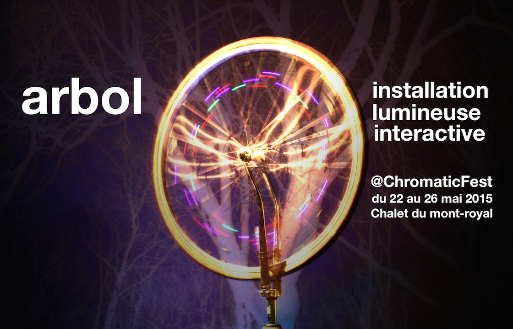

ARBOL, 2015,  présenté au festival Chromatic 2015

Arbol est une installation lumineuse interactive in situ qui a pour support un arbre vénérable. L’expérience sonoluminescente d’Arbol s’articule autour du mouvement dégagé par l’interaction collective.  La rotation exercée sur chacune des roues se transforme en impulsions lumineuses ascendantes à travers de larges tubes qui emmaillotent les branches d'un arbre.

Utilise max msp, arduino et OSX
