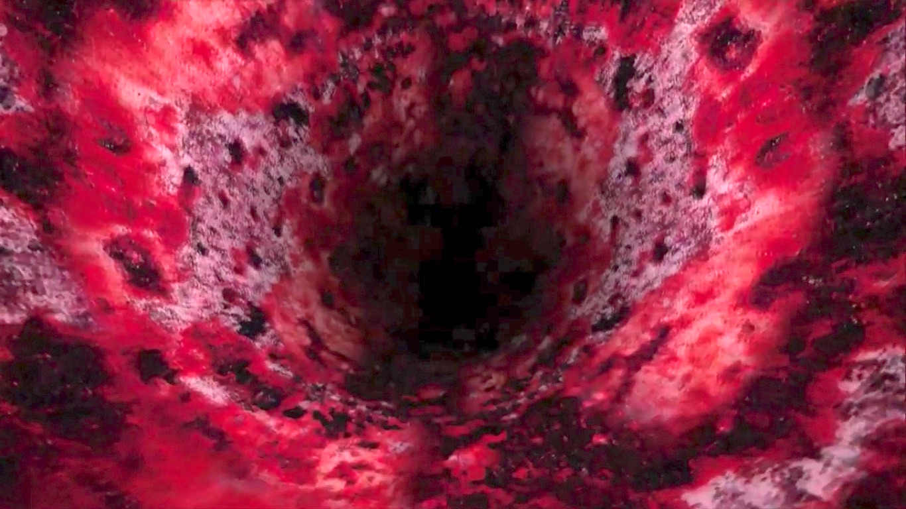

B-Cycle, 2012,  présenté à Eastern Bloc,  créée en collaboration avec Julien Gingras, Mathieu Clouthier,  Francis Dakin et Simon Meloche.

B-Cycle est une installation immersive où l'interacteur pédale sur un vélo stationnaire et bouge son corps afin naviguer à travers les veines d'un système sanguin virtuel.

Utilise max msp, arduino, kinect et OSX

 
<iframe src="https://player.vimeo.com/video/28824908?title=0&byline=0&portrait=0" width="100%" height="400" frameborder="0" webkitallowfullscreen mozallowfullscreen allowfullscreen></iframe>

<a href="https://vimeo.com/28824908">B-Cycle</a> from <a href="https://vimeo.com/gllmar">Guillaume Arseneault</a> on <a href="https://vimeo.com">Vimeo</a>.

