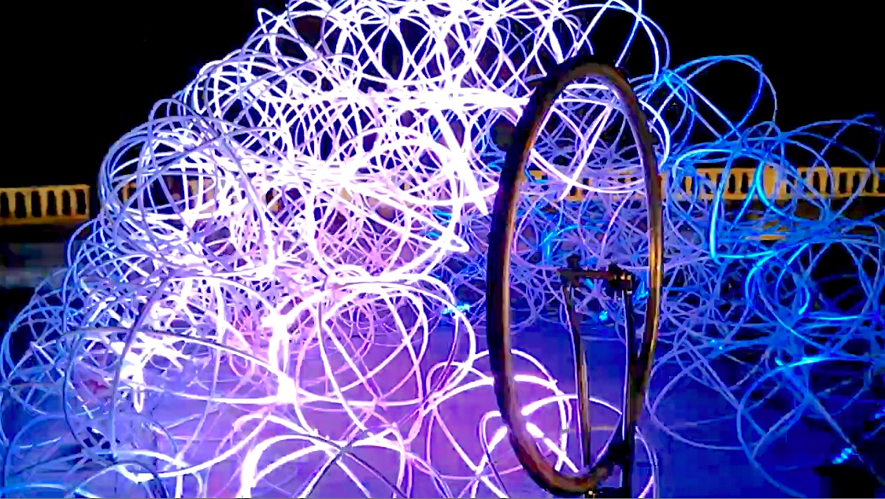
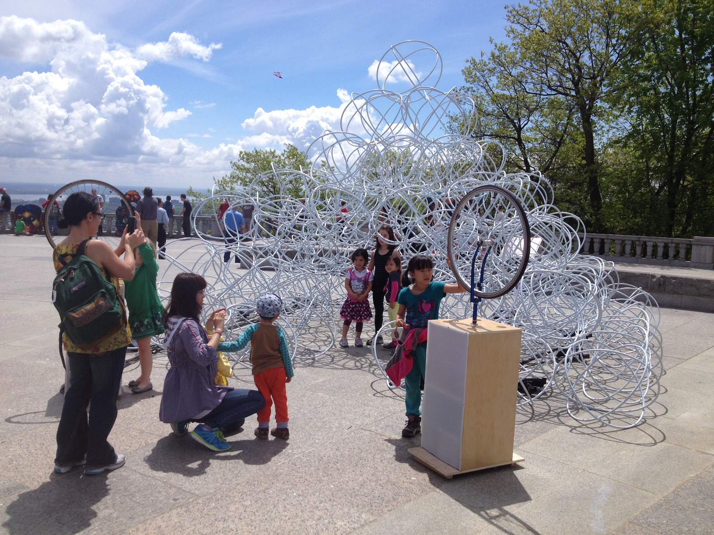

Roue libre interactive générant son et lumière pour sculpture de cerceaux.

Présenté au festival Chromatic 2014
Collaboration avec la Camaraderie

Fonctionne en utilisant un arduino et un raspberry pi.
[github.com/gllmAR/marcels](https://github.com/gllmAR/marcels)

