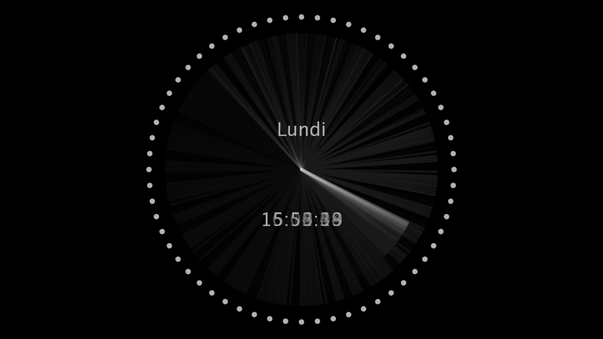

Chorégraphie audiovisuelle interactive pour danseur contemporain.

Présenté avec Antoine Turmine dans le cadre d'une exploration pour un nouveau spectacle -7-

Collaboration avec la compagnie de danse Zogma

V1 Fonctionne avec pure data et processing.
[github.com/gllmAR/marcels](https://github.com/gllmAR/aClock)
