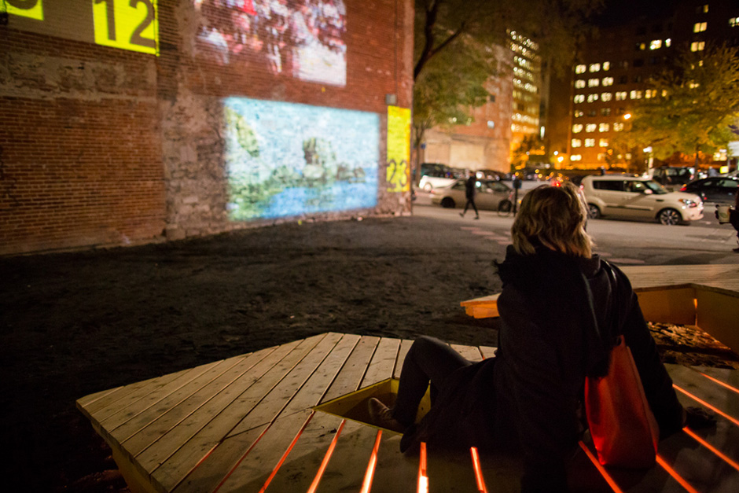
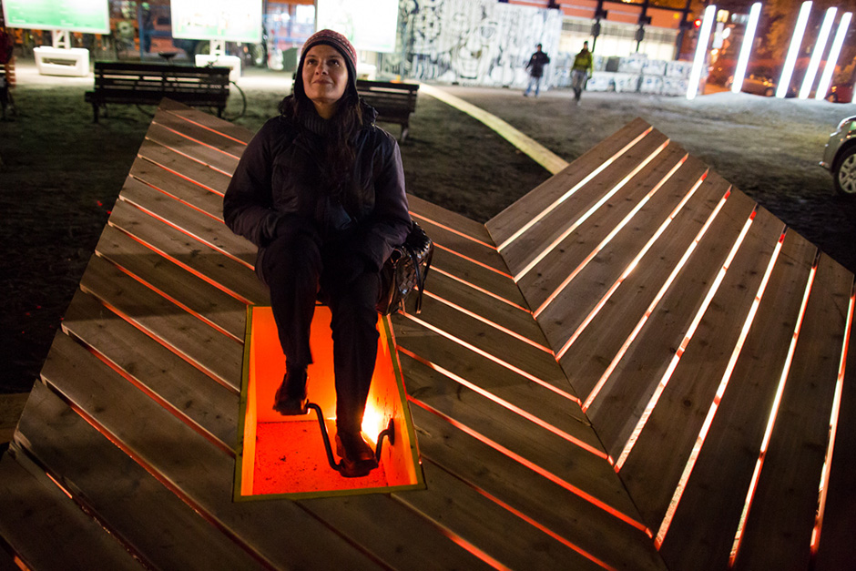
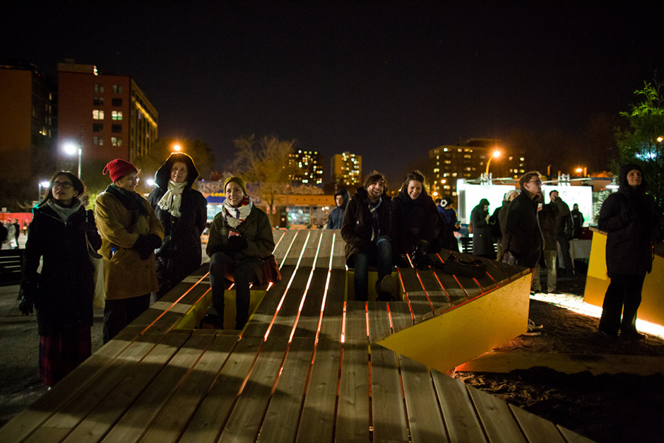
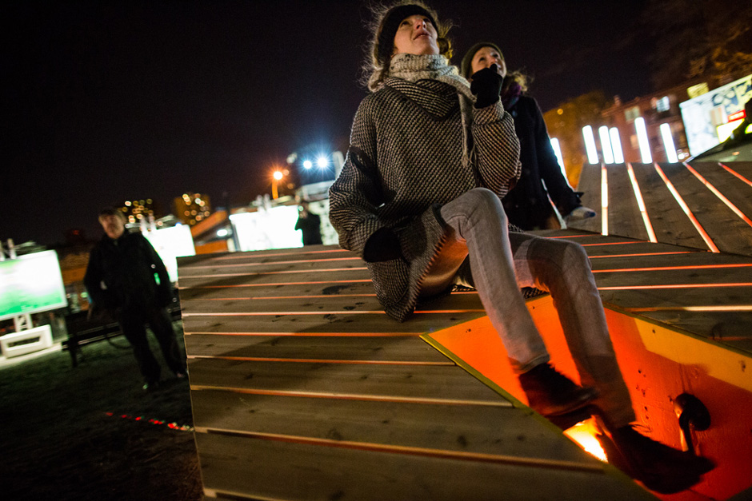
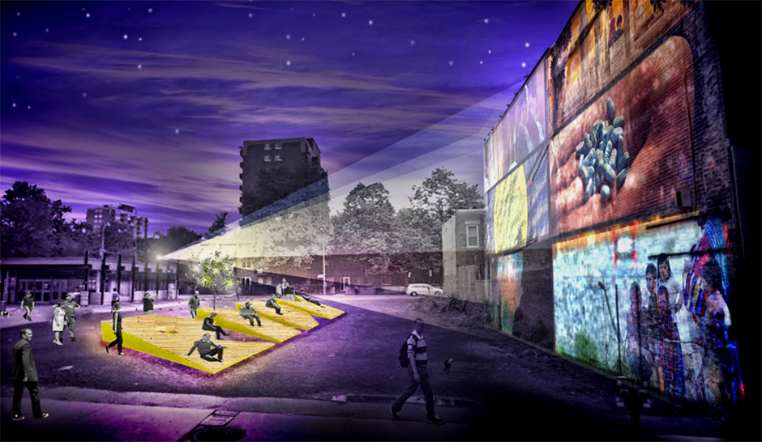

Projection documentaire activée au rhytme des pédaliers.

Présenté en 2013 au Métro St-Laurent en collaboration avec le Quartier des spectacles et les RIDM  (Rencontres internationales du documentaire de Montréal)

En collaboration avec :
Pete & Vegas et
Marilyne G-Leduc

Fonctionne en utilisant un arduino, Max MSP et OSX

