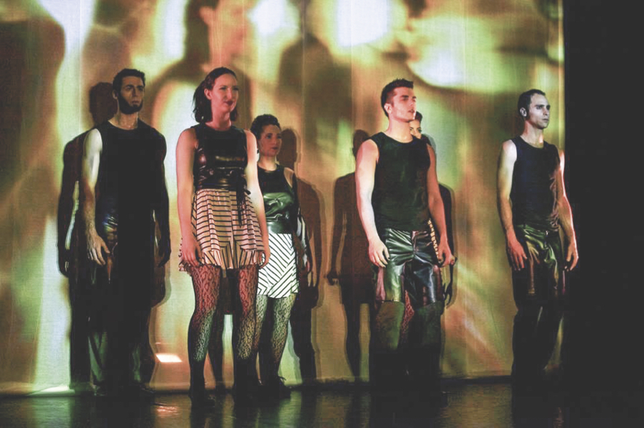

Conception vidéo interactive, logiciel et opération «live»

avec la compagnie de danse Zogma depuis 2013

Logiciel de mixage accessible ici :
[github.com/gllmAR/gridblend](https://github.com/gllmAR/gridblend)

info : [zogma.ca](http://www.zogma.ca/#!sens-2013/c1czz)

<iframe src="https://player.vimeo.com/video/67103127" width="100%" height="281" frameborder="0" webkitallowfullscreen mozallowfullscreen allowfullscreen></iframe>

<a href="https://vimeo.com/67103127">Z&oslash;gma - extrait - De l&#039;autre cot&eacute; de l&#039;image</a> from <a href="https://vimeo.com/arseninc">Gllm Arseno</a> on <a href="https://vimeo.com">Vimeo</a>.

