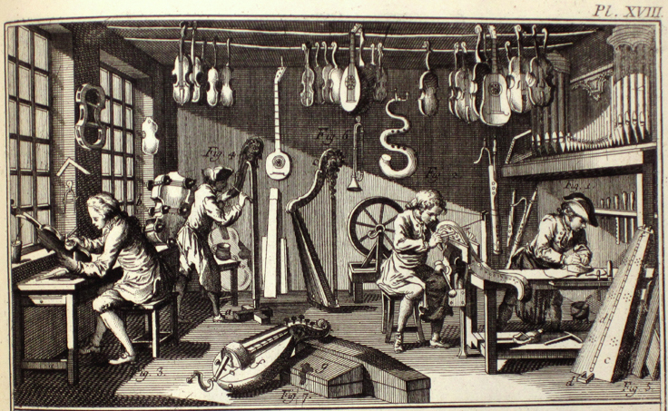
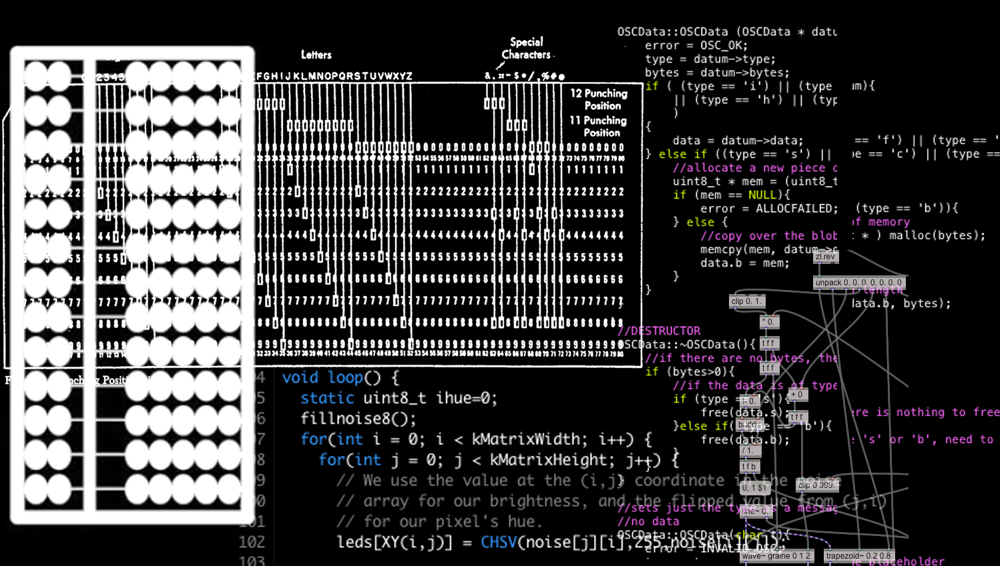
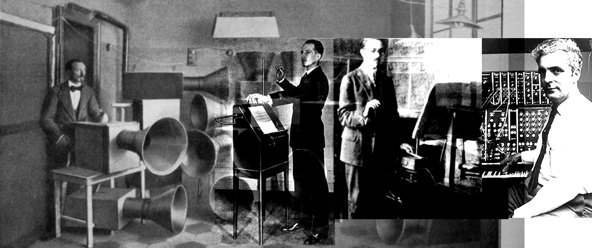
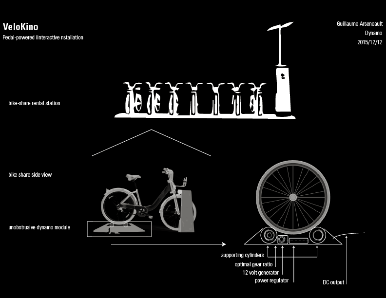
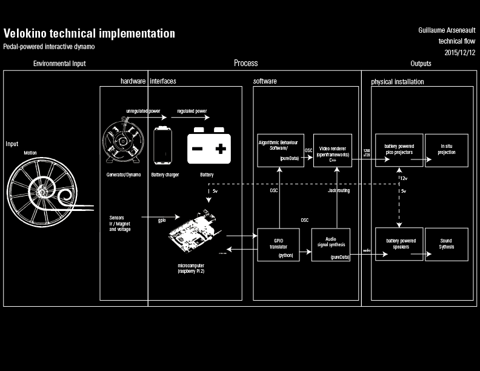

<section data-markdown>

#  *Lutherie numérique* & interactivity

## Research based practice on crafting interactive audiovisual experiences.  

### Guillaume Arseneault

laureando *Recherche-création en média expérimental* UQAM

</section>

<!--Introduction générale sur les termes énoncés dans le titre

«
In this presentation I will comment on each term in the title 

And how they are related to my research object.

»
  

-->

<section data-markdown>

## Lutherie 
 
Related to the process of crafting string instruments

Lutherie [from Dictionnaire raisonné des sciences, des arts et des metiers / Denis Diderot]

<!--
Commentaire sur la traduction  

-->

</section>

<section data-markdown>
## *Numérique* / Numeric
Representation through a number system, often related to computerized operations.

</section>

<section data-markdown>
## Lutherie numérique

> forme d'expression dont le "médium" est constitué par les relations réciproques qui s'établissent entre le propos artistique et son implémentation technologique. 

Burton, Alexandre. 2000. « Lutherie Numérique .» In . Montréal : Festival du nouveau cinéma.

: expressive form emerging from the reciprocal relations between artistic intents and his technological implementations

- The act of choosing the components for a purpose, getting them to work together and making the instrument expressive.
- Where a computer and programmation is injected between the instrument and the performance output
- The importance of real-time is critical to get physicality of the instrument

<!--

Apprentis de Burton

Exemple : pour préciser ce en quoi la lutherie numérique se distingue 

Artificiel : Bulbes

Create the hardware and the software to 

-->

</section>

<section data-markdown>

## Research based practice & experimental media
* #### Iterative’s cycles of prototyping and demonstrations 
* #### Artistic process feed from heuristic feedback 
* #### Reflective praxis

Authors : 

* Owen Chapman & Kim Sawchuk :  “Research-Creation: Intervention, Analysis and Family Resemblances.’” 

* Louis Claude Paquin : "Méthodologie de la recherche-création"
* Pierre Gosselin, Éric Le Coguiec : "
La recherche création :
Pour une compréhension de la recherche en pratique artistique
"

</section>

<section data-markdown>

## Analog Pioneers 
* [Luigi Russolo] 1885–1947
	* Intonarumori (Mechanical sound automates)
* [Leon Theremine] 1896-1993
	* invented the *Theremine* 	
* [Maurice Martenot] 1898-1980
	* invented the *ondes Martenot* 
* [Robert Moog] May 1934-2005  
	* known for his work on the analogue synthesizer 

</section>

<section data-markdown>

##  *Lutherie numérique* : Contemporary

* [Miller Pucket](http://msp.ucsd.edu/)
	* Data Flow programming : Max Msp, Pure Data
* [David Rockeby](http://www.davidrokeby.com/vns.html)
	* Interactive Video tracking System : (Surveillance art) 
	* Very Nervous System (softVNS)
* [Alexandre Burton](http://www.artificiel.org/burton)
	* Tesla Coil [impact](http://www.artificiel.org/impacts)
	* Power, condemned bulbs  
* [Robert Henke](http://www.monolake.de)
	* Live Sampling and sound triggering 
	* Founder of the Ableton Live Software
	* Create the Monodeck,  which became the Akai APC40

<!--

https://cycling74.com/2009/11/21/an-interview-with-robert-henke/#.Vt3z7sfKJOo

Klaus obermayer
alvin oto

-->

</section>

<section data-markdown>
## Motivations 
* Generate novel experiences modified by the user engagements    
* Create interfaces-instruments with expressive range accessible  
* Deploy interactive installations in public spaces
* Share and document this process among the Makers community (open source)
* Contribute to democratize technological creations trought low cost hardware 

</section>

<section data-markdown>
## Input  
* Electricity
* Motion (on interactive interfaces)

</section>

<section data-markdown>
## Control signal and processing
* DC Power (0-5 volts)
* Input Processing
	* Hardware engineering 
	* Electronic etching 
	* Firmware programming  
* Numerical data 
	* Midi  
	* Dmx 
	* OSC	
* Expressive data mapping 
	* Software programmation 
	* Data flow/ procedural paradigms
	* States machine 	 

</section>

<section data-markdown>
## Output	
* Sound 	
* Video
* Light

</section>

<section data-markdown>
## VeloKino	

* 2012 [B-Cycle](/projets/bcycle)
* 2013 [Kinopedal](/projets/pedalier)
* 2014 [RUSH](/projets/rush)
* 2014 [Marcels](/projets/marcels)
* 2015 [Arbol](/projets/arbol) 

</section>

<section data-markdown>

</section>

<section data-markdown>

</section>

<section data-markdown>
## [Why?] 	

</section>

<section data-markdown>
## Demo [or die] 

Thereminir

[github.com/gllmar/thereminir](http://github.com/gllmar/thereminir)

[*Demo or die* : Nicolas Negroponte,  MIT Media lab]

</section>

<section data-markdown>
# Q/A? 	

</section>

<section data-markdown>
## Guillaume Arseneault

### [gllmar.github.io](http://www.gllmar.github.io)

### [guillaume@artificiel.org](mailto:guillaume@artificiel.org)

</section>

<!--

<section data-markdown>
## Implementation models
* Centralized vs Decentralized ressources  
* Integrated vs Segmented programmation

</section>

<section data-markdown>
## Interfaces
* Affordance 
* Sensors
* Integrated vs Segmented programmation

</section>

<section data-markdown>

##  *Lutherie numérique*

 
GUILLAUME ARSENEAULT, 
 
TITRE : « Lutherie numérique et interactivité »

ABSTRACT : Je traiterai des fondements de la recherche-création en média expérimental, spécialisation de mon cursus UQAM, et je présenterai mon projet de maîtrise.
Il s’agira d’explorer le processus de détournement et d'appropriation de certaines technologies appliqués à un contexte d'installations audiovisuelles interactives.
La présentation recoupera des exemples pratiques extraits de la recherche entourant le projet – en divers volets – VéloKino (recherche-création axée sur la réinjection cinétique en interactivité). Spécifiquement appliquée au mouvement de rotation cyclique d’une roue de vélo, cette étude porte sur la transformation d’une donnée acquise en vecteur d’expression audiovisuelle sensible. Au cœur de cette recherche-création s’articulent interactivité, électronique, animation visuelle, synthèse sonore et lumineuse. Toutes ces composantes convergent  dans l’objectif de générer une expérience augmentée par l’implication active de l’interacteur – à la fois spectateur et usager – dans l’installation.
Il s’agira au final de voir, et tester avec les participants, comment, dans un contexte artisanal et expérimental, les solutions technologiques peuvent ouvrir sur des registres d’expression nouveaux.

</section>

<section data-markdown>
## Deuxieme View

Je crée des installations publiques qui exigent de la part des visiteurs un engagement physique pour les activer. Elles se modifient en fonction de la manière par laquelle le spectateur met en relation les mouvements de son corps avec le dispositif interactif. L'expérience esthétique devient l'exploration du mouvement physique augmenté, par algorithmes, d'images, sons et lumières.   

C'est à la jonction de la technologie fine et du savoir-faire artisanal que je crée ce que l'on peut définir comme de la lutherie numérique. Mes dispositifs technologiques, en plus d'être à chaque fois conçus spécifiquement pour un usage, comme un luthier conçoit un violon unique pour chaque violoniste, sont aussi des instruments avec lesquelles on joue (au sens ludique et au sens de l'exécution).   

Je cherche à inciter le spectateur à fournir un effort sous forme d'énergie cinétique afin d'activer différentes composantes de l'installation. Par extension, je cherche à rendre l'installation interactive autonome, car alimentée par l'effort qu'on lui fournit.  
Une inspiration centrale à mon processus de recherche-création est la bicyclette. En pédalant on avance, en avançant on découvre, en roulant on se libère. Je crois que la pratique du vélo aide à développer l'autonomisation et l'affranchissement au sein d'une société de plus en plus énergivore.

L’autonomie électrique est en effet une préoccupation éthique de mon travail, ainsi qu’un défi technique que je me passionne à relever. Il s’agit en somme pour moi de mettre au point un système qui transforme l'énergie cinétique en électricité stockée et prête à l'usage par le système. Ce dernier peut alors gratifier l’effort en offrant à la vue et à l'ouïe des phénomènes sensibles. Cela permet par ailleurs dans un deuxième temps à l'installation – autonome qu’elle soit – de devenir nomade.

1) IUAV, Venezia, 8 mars, « Lutherie numérique et interactivité » : lors d’un séminaire pour les étudiants des études avancées, je traiterai des fondements de la recherche-création en média expérimental, spécialisation d'Hexagram et de mon cursus à l'UQAM.  Je présenterai mon projet de maîtrise ainsi que ceux auxquels j'ai participé comme étudiants-chercheur (Irradier avec Gisèle Trudel et Domaine de la frontière enchantée avec Éric Létourneau). Chaque participant à ce séminaire d’une journée recevra un retour critique sur son projet dans un milieu international (des étudiants italiens, français et québécois y participent), se confrontant avec des collègues aux parcours différente, mais tous axés autour de la recherche-création.
Plusieurs professeurs (IUAV, UQAM, EHESS-Paris, University of St Andrews) participent à cette activité ce qui promet un feedback multiple et original à l’étudiant.

2) FilmForum Udine, Gorizia, 12 mars, « VeloKino: sensors mapping and interactive audiovisual experiences » : je donnerai un atelier portant sur les processus de recherche-création appliqués à la confection d’objets interactifs. Il s’agira d’explorer comment le détournement et l’appropriation de certaines technologies peuvent s'appliquer à des contextse d’installations audiovisuelles sensibles. L’atelier se servira d’exemples pratiques effectués sur place et extraits de mon projet VéloKino (création pilier de ma maîtrise). Il s’agira au final de voir, et tester avec les participants, comment, dans un contexte artisanal et expérimental, les solutions technologiques peuvent ouvrir sur des registres d’expression nouveaux.

Burton fantome

Pour attraper des fantômes
La lutherie numérique est une forme d'expression à part entière. Une forme d'expression dont le "médium" est constitué par les relations réciproques qui s'établissent entre le propos artistique et son implémentation technologique. En faisant disparaitre "l'ordinateur" dans une chaîne technologique transparente, le luthier invente un nouveau registre de rapports avec les médias. Il ne s'agit pas simplement, comme certains l'entendent, de lubrifier le point de contact entre l'art et la technologie, mais bien de concevoir l'interface entre le propos artistique et son implémentation technologique.
Les vieilles dualités (forme/materiau, logiciel/données, contexte/contenu) s'estompent pour laisser place à un seul et même construct: l'oeuvre virtualisée. Cette virtualisation définit l'oeuvre non pas comme un "objet", mais davantage comme un potentiel, un potentiel ouvert à l'interprétation. Ce potentiel s'articule autant dans son implémentation technologique que dans sa substance artistique.
En permettant le tissage de lien entre les differents modes d'expression, en soudant des relations entre les médias, la lutherie numérique permet de se rapprocher davantage de la substance artistique car, bien exécuté, le dispositif technologique est le propos même, et rend inévitable son actualisation, tout en justifiant l'action de l'interprète. (Du coup, la notion de performance regagne ses lettres de noblesses, lettres qui, on doit l'avouer, on été quelque peu ternies par la prolifération récente des "concerts de powerbooks" ou l'on se contente souvent de surveiller son sequenceur, un logiciel dont les conséquences sont strictement prédéfinies. En conscientisant le geste comme moteur du processus d'actualisation, on se doit de justifier la présence sur scène en rapport avec l'oeuvre).
L'idée artistique est un fantôme, auquel l'artiste tente de donner forme en le fixant dans un médium ou une forme d'expression. Les médias ne viennent que "représenter" l'idee, ils ne sont pas cette idée, tout comme le drap jeté sur le fantôme n'est pas ce dernier. En implémentant l'idée dans un instrument de lutherie numérique plutôt que dans une forme figée, on laisse le fantôme en liberté et le loisir à chacun de jeter un drap pour (peut–être) l'attraper.
L'art ne consiste plus ici a composer un "message" (...). Un nouveau type d'artiste apparait, qui ne raconte plus d'histoire. C'est un architecte de l'espace des événements, un ingénieur de mondes pour des milliards d'histoires à venir. Il sculpte à même le virtuel.*
C'est le luthier du numérique.
Alexandre Burton, Montreal, octobre 2000
*P. Levy, Qu'est-ce que le virtuel?, La Decouverte, Paris, 1998.

</section>

-->

