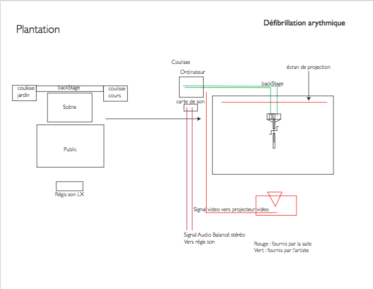

Défibrillation arythmique est une performance physique pour vélo stationnaire interactif. 
Le son devient un vecteur de l’effort ressenti par le coeur de l’athlète conjugué à la vitesse atteinte. La fréquence cardiaque du performeur se traduit un repère percussif, la rotation de la roue construit et alimente la trame mélodique.
La mise en phase de ces deux cycles (pouls et vitesse de rotation) détermine l’esthétique du traitement sonore de la friction du mécanisme de résistance.  
Trouver son rythme à travers un système sans qu’il nous domine; percevoir l’écho à entre l’arythmie et la défibrillation. 
 
 

 Récipiendaire de la bourse Sennheiser en nouveau média (maitrise) 
 
 
 
Partition : 

#### mise en place du dispositif [~ 1minutes]

* une fois l’espace scénique libre, j’entre sur scène
* j’installe le module d’entrainement pour vélo au centre de la scène. (30 secondes). 
* Je vais chercher mon vélo en coulisse.
* J’installe le vélo sur le module d’entrainement
* Je donne un coup de pédale pour valider le cliquetis du module électronique
* J’embarque sur le vélo.
* :[Cue son] > volume de -∞ à 0db

#### Découverte du dispositif mélodique et mécanique[~ 45 secondes] 

* je donne lentement quelque coup de pédale.
* à chaque 1/4 de révolution, on entend une note que produit le vélo 
* je pédale un peu plus vite, un peu plus lent, pour bien établir que la vitesse de la roue influence la mélodie

#### Découverte du dispositif rythmique [~45 secondes]

* Je pédale plus rapidement, style sprint pour accélérer ma fréquence cardiaque. 
* Je cesse de pédaler, j’attends que la roue s’immobilise.
* le rythme du coeur occupe tout l’espace sonore,
* je respire lentement et je relaxe, je médite jusqu’à ce que ma fréquence cardiaque ce stabilise

#### [Mise en phase] [2 minutes]
* Augmentation croissante de la cadence,
* Mise en relation, juxtaposition et jeu entre les composantes sonore, rythme (pouls),
mélodie(vitesse). Jusqu’à ce que les deux éléments arrivent à une harmonie soutenue.

#### [Sprint (Fibrilation)] [30 secondes]
* dans cette période, je donne toute l’énergie 
* le coeur s’emballe

#### [Défibrillation.] [~30 secondes]
* je m’effondre sur le guidon.
* le coeur feint l’arrêt
* : [Cue LX] Blackout. 5 secondes

#### [Fin]
* : [Cue LX] lumière générale. Salut

* Je sors avec le matériel. (10 secondes.) -

