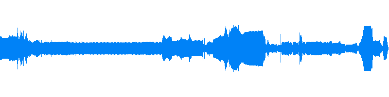
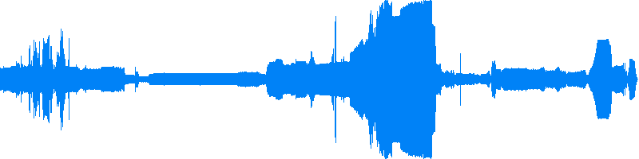
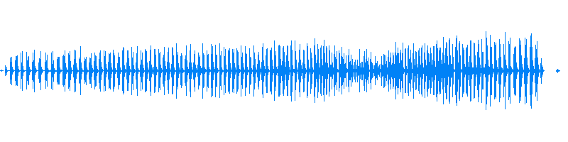
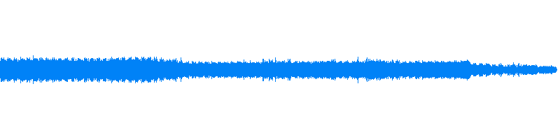

 
Étude pour transducteur: deuxième couche, 2016

<audio controls   >
	<source type="audio/m4a" src="medias/etude_transducteur-2e.m4a">
    <source type="audio/mp3" src="medias/etude_transducteur-2e.mp3">
    <source type="audio/ogg" src="etude_transducteur-2e.ogg">
</audio>

 
Étude pour transducteur: 2016

<audio controls  >
	  <source type="medias/mp3" src="https://media.githubusercontent.com/media/gllmAR/gllmar.github.com/master/projets/audio/etude_transducteur.m4a">
      <source type="medias/mp3" src="https://media.githubusercontent.com/media/gllmAR/gllmar.github.com/master/projets/audio/etude_transducteur.mp3">
      <source type="medias/ogg" src="https://media.githubusercontent.com/media/gllmAR/gllmar.github.com/master/projets/audio/etude_transducteur.ogg">
</audio>

 
Défibrilations arythmique, 2014
<audio controls   >
      <source type="medias/mp3" src="https://media.githubusercontent.com/media/gllmAR/gllmar.github.com/master/projets/audio/arythmie.mp3">
      <source type="medias/ogg" src="https://media.githubusercontent.com/media/gllmAR/gllmar.github.com/master/projets/audio/arythmie.ogg">
</audio>
 

 
boite-a-message-jam-110119, 2011
<audio controls   >
      <source type="medias/mp3" src="https://media.githubusercontent.com/media/gllmAR/gllmar.github.com/master/projets/audio/boite-a-message-jam-110119.mp3">
      <source type="medias/ogg" src="https://media.githubusercontent.com/media/gllmAR/gllmar.github.com/master/projets/audio/boite-a-message-jam-110119.ogg">
</audio>

 

