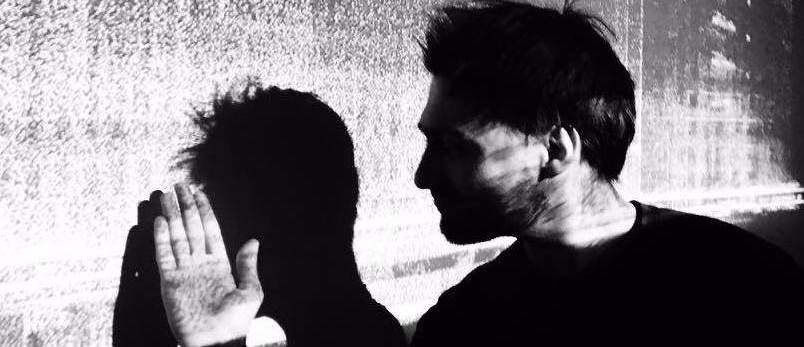

Artiste numérique, *Guillaume Arseneault* détourne pixels, octets, photons et longueurs d'onde en utilisant la programmation logicielle et l'électronique pour créer des expériences interactives novatrices.

Captivé par les relations entre l'énergie cinétique, l'électricité, le digitale et le vivant, il hybride les technologies pour créer des installations où mouvements et efforts s'entrelacent pour alimenter le spectaculaire critique et l'intrigant. Sensible à l'obsolescence programmée, il conçoit dans une perspective  d'affranchissement des technologies propriétaires tout en demeurant le plus économe possible au niveau des ressources dépensées.       

De l’installation immersive à la projection architecturale en passant par la conception sonore, lumineuse et technologique, la diversité des projets constitue son carburant créatif.

Actif depuis 2010,  ses créations interactives ont été présentées entre autres par *[MASSIVart](http://massivart.ca)*,  *[Eastern Bloc](http://www.easternbloc.ca)*, *[le Quartier des spectacles](http://www.quartierdesspectacles.com/fr/)*, les *[RIDM](http://www.ridm.qc.ca/fr)*, [ArtBangBang](https://www.artbangbang.com/index), le *[FNC](http://www.nouveaucinema.ca/#/)*, *[Igloofest](http://igloofest.ca)*, la *[Société des arts technologiques](http://sat.qc.ca)*, l*'[Office national du film du Canada](https://www.onf.ca)* et le [Filmforum](http://www.filmforumfestival.it/).

Depuis 2011 il travail l'interactivité au sein d'[artificiel](https://www.artificiel.org), studio de création.  

Guillaume Arseneault hijacks technologies to create novels interactives experiences. 
Driven by a desire to provoke reactions and dialogues toward ourselves in the digital era,  his pieces investigates the kinetic feedback sustainability in interactives audiovisuals environments. 
From immersive installations to architectural projections, lighting, sound and technological designs, the breadth of his interests is his creative fuel. Since 2011, he has worked as a interactive designer at Artificiel.org
