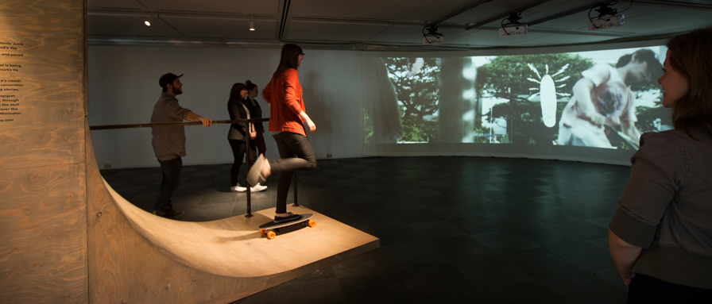

Une installation interactive qui revisite le cinéma d’auteur. Pour fêter les 75 ans de L’ONF, 14 réalisateurs en provenance de 8 pays et de 4 continents ont revisité le film précurseur Rouli-Roulant, l’un des premiers films portant sur le skateboard, produit par Claude Jutra en 1966. The Devil’s Toy Redux est une série de réinterprétations du film original proposée dans une installation Web développée par Judith Portier où les visiteurs peuvent accéder aux films et à leur contenu en naviguant à travers les thématiques abordées et explorer chaque ville selon son désir. Ils sont invités à monter sur un skateboard reposant sur une rampe. Ce skate est en fait la manette de contrôle, et ainsi chacun peut créer sa propre expérience cinématographique tout en faisant profiter les autres visiteurs du spectacle par un écran circulaire géant de 180 degrés. Présentée à la Place des Arts pour souligner l’anniversaire de l’ONF, cette installation est démontable et elle peut s’adapter à une grande variété d’espaces. À la fois ingénieuse et spectaculaire, elle propose une expérience globale en lien avec l’histoire underground de rébellion et de refus de se conformer aux normes propre aux adeptes du skateboard. Avec son atelier de design d’environnement, Design par Judith Portier crée des lieux rassembleurs et diffuseurs de contenu. L’interaction entre l’espace et ses utilisateurs est au cœur de son approche, et l’installation The Devil’s Toy Redux, qui a remporté le Prix stand de foire de 400 pi2 et plus, en est un exemple spectaculaire.

crédits: 
Production : ONF 
Design : Judith Portier
Dispositif interactif et projection vidéo : artificiel 

