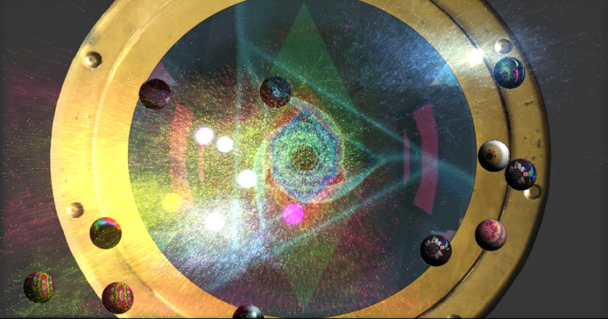

Hublot est une installation audiovisuelle qui répond au toucher des doigts sur la surface de projection.

Chacune des sphères contient un synthétiseur granulaire et une vidéo en boucle qui lorsque touchées s'activent. 

Utilise Max et Tuio.

Récipiendaire de la bourse en art numérique ArtTv 2016 offerte par Radio-Canada  

code et documentation disponible ici

[https://github.com/gllmAR/hublot](https://github.com/gllmAR/hublot)
