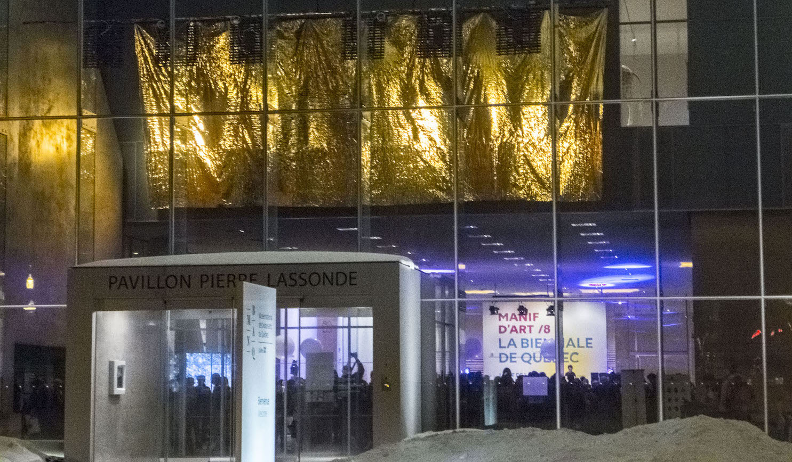
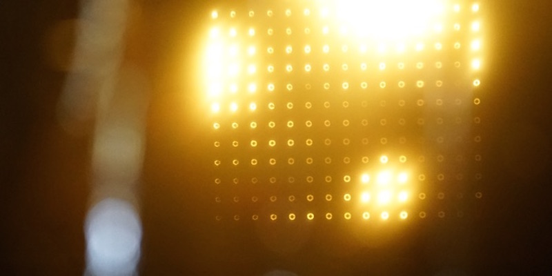
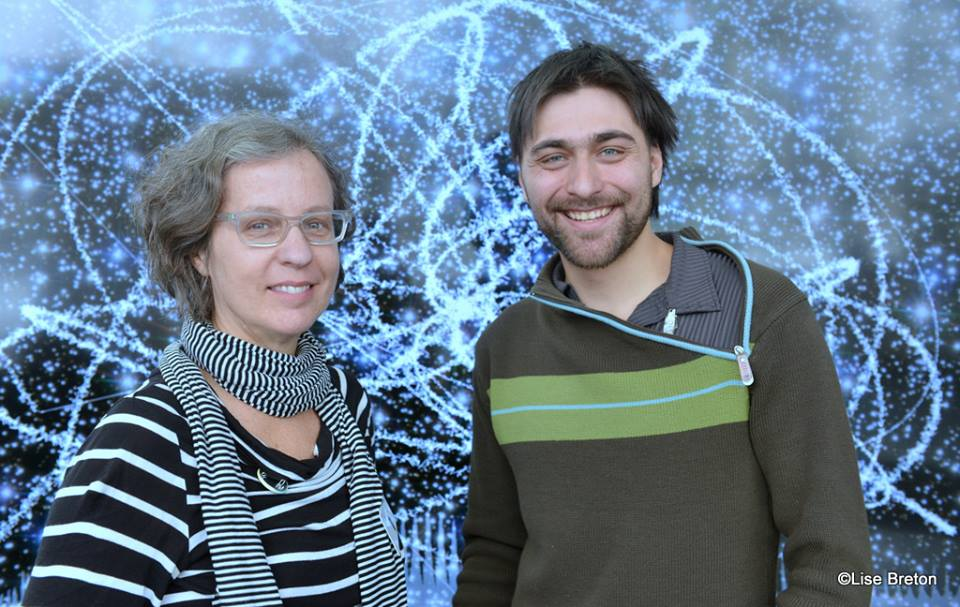

Installation lumineuse

Grâce à un processus d’échantillonnage d’images du cosmos, des ciels étoilés sont transformés en une captivante chorégraphie de lumières dont les modulations créent sans cesse de nouvelles constellations. L’œuvre Intersidéral tisse ainsi des liens entre la nature et la technologie; le proche et le lointain; le quotidien et le merveilleux.

Projet porté par Gisèle Trudel [aelab](http://aelab.com/wp/), Intersidéral est une installation qui part de la lumière qui à traversé le cosmos pour s'imprimer sur des photos prises par des télescopes. Ces photos servent de matière première à un logiciel (pix2light) qui échantillonne l'image et transforme la luminance des pixels vers des intensités lumineuses (Art-net) afin d'illuminer les panneaux lumineux. La lumière émise les panneaux est projetée sur une membrane mylar dorée ce qui produit un chatoiement lumineux de couleur très chaude, et ce dans tout l'espace que l'œuvre habite. 

Matériaux :

* Lumière Elidy
* raspberry pi 
* moniteur HD
* Artnet
* membrane monumentale de mylar or
* photos de l'espace
* openframworks
* archlinux
 
[github.com/gllmAR/pix2light](https://github.com/gllmAR/pix2light)

[Présenté dans le cadre de manif d'art 8](http://manifdart.org/manif8/programmation-officielle/aelab/)

[actualités UQAM](https://www.actualites.uqam.ca/2017/gisele-trudel-a-la-biennale-de-quebec-et-au-macl)

