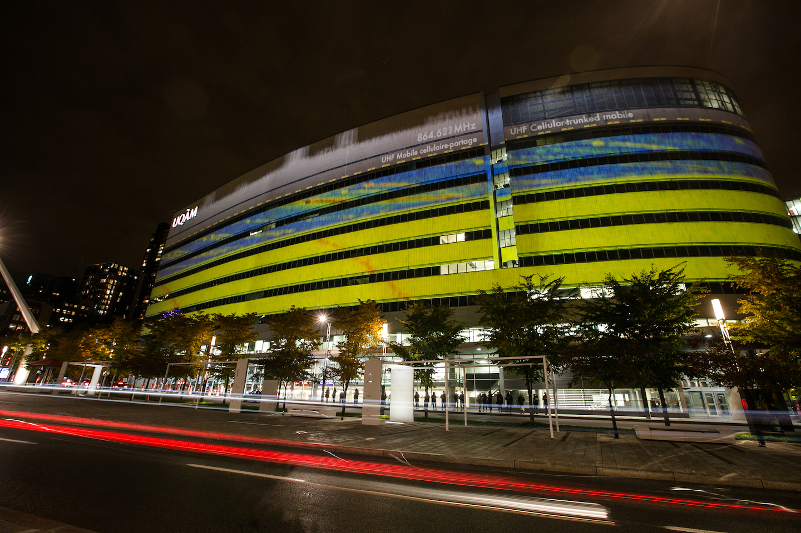

Projection architecturale d'artéfacts électromagnétique temps réel;
Co-création avec Ælab (Gisèle Trudelle),  Hexagram, Grupmuv PQDS;
Présenté sur la façade du pavillon Président-Kennedy durant [RE-CREATE 2015](http://www.hexagram.ca/en/activities/re-create-2015/) ainsi qu'à ELEKTRA 2016 lors de la Biennale d'art numérique de Montréal [BIAN-Elektra 2016](http://bianmontreal.ca/artistes/guillaume-arseneault) 

<iframe src="https://player.vimeo.com/video/148788802" width="100%" height="320" frameborder="0" webkitallowfullscreen mozallowfullscreen allowfullscreen></iframe>

<a href="https://vimeo.com/148788802">AElab with Guillaume Arseneault. irradier.irradiate (v1), 2015</a> par <a href="https://vimeo.com/user16372138">aelab.com</a> 

Couverture : 

* [BIAN-2016](http://bianmontreal.ca/programmation/irradier-irradiate)
* [AELAB](http://aelab.com/wp/irradier-irradiate/)
* [grupmuv](http://grupmuv.ca/?portfolio=irradier-irradiate)
* [ACFAS](http://www.acfas.ca/evenements/congres/programme/84/special/297641)
* [actualité Uqam](http://www.actualites.uqam.ca/2015/irradier-nouvelle-projection-architecturale-au-pavillon-pk)
* [Salle de Presse UQAM](https://salledepresse.uqam.ca/communiques-de-presse/general/6941-colloque-re-create-2015-les-membres-d-hexagram-presentent-leur-recherche-et-creation)
* [Hexagram Re-Create](http://www.hexagram.ca/en/activities/re-create-2015/)
* [La Presse](http://www.lapresse.ca/arts/arts-visuels/201511/04/01-4917264-colloque-re-create-a-lecole-de-la-creation.php)
* [PatWhite](http://patwhite.com/biennale-internationale-dart-numerique-bian-elektra-17-les-premiers-artistes-devoiles)

