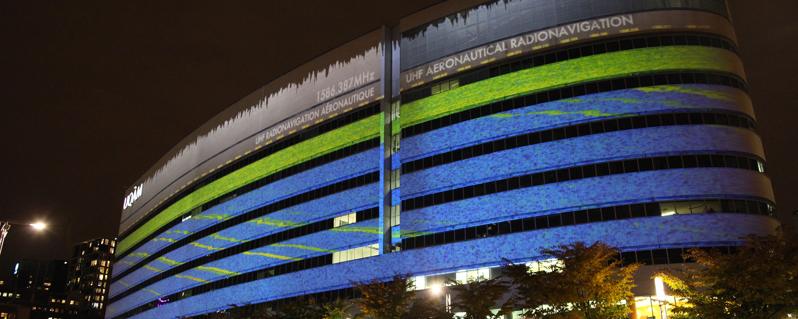

Projection architecturale d'artéfacts électromagnétique temps réel;
Co-création avec Ælab (Gisèle Trudelle),  Hexagram, Grupmuv PQDS;
Présenté sur la façade du pavillon Président-Kennedy durant RE-CREATE 2015

<iframe src="https://player.vimeo.com/video/148788802" width="100%" height="281" frameborder="0" webkitallowfullscreen mozallowfullscreen allowfullscreen></iframe>

<a href="https://vimeo.com/148788802">AElab with Guillaume Arseneault. irradier.irradiate (v1), 2015</a> from <a href="https://vimeo.com/user16372138">aelab.com</a> on <a href="https://vimeo.com">Vimeo</a>.

