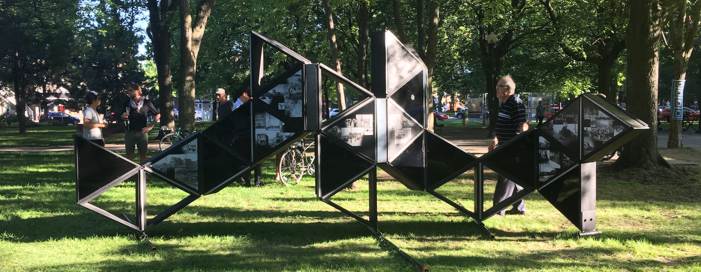

Laps est une installation historique, artistique et architecturale dont le point de départ est la mémoire. Grâce à la participation des résidents âgés, c’est une histoire inédite du quartier qui est racontée!
Construit à partir des photographies anciennes et des enregistrements issus des rencontres d’ainés, Laps est un révélateur de souvenirs.

<iframe src="https://player.vimeo.com/video/227412427?byline=0" width="100%"  height="480"   frameborder="0" webkitallowfullscreen mozallowfullscreen allowfullscreen></iframe>

L’inspiration principale du dispositif se situe quelque part entre le fonctionnement du cerveau (des flux entre des synapses) et celui d’un serveur informatique.
Laps, un projet spécial d’arrondissement pour le 375e anniversaire de Montréal, est une collaboration entre Architecturama, un bureau d’architectes, Frédéric Lavoie, artiste dont le travail se situe au croisement de la sémiologie et de l’ethnographie visuelle, et M. Claude Perreault, un passionné d’histoire et de photographies anciennes.

 

L’œuvre est animée en permanence par la lumière et le son. Elle se déplace à chaque semaine durant dix semaines dans un espace public différent de l’Arrondissement de Rosemont – La Petite-Patrie. En partenariat avec le RACRPP, des médiations présentent l’œuvre aux visiteurs et animent des discussions participatives sur l’histoire de l’arrondissement. Des activités spéciales sont aussi prévues. Consulter les horaires et les lieux

Le projet LAPS est un événement de la programmation officielle des festivités du 375e et il est rendu possible grâce à la contribution de la Ville de Montréal et du Gouvernement du Québec.

[RACRPP](http://www.racrpp.org/laps/)

« Montréal, mardi 25 juillet 2017 – Pour célébrer localement le 375e anniversaire de Montréal, l’arrondissement de Rosemont–La Petite-Patrie lance son projet LAPS, une œuvre qui raconte l’histoire des quartiers à partir des témoignages et des photos d’époque des aînés qui y vivent. L’œuvre se déplacera dans dix parcs et lieux publics de l’arrondissement durant 10 semaines, du 29 juillet au 8 octobre.

LAPS est une installation éphémère mobile, lumineuse et sonore, qui amalgame l’histoire, l’art et l’architecture, en ayant le thème de la mémoire comme trame de fond. L’installation est composée de plusieurs structures mobiles qui peuvent s’agencer de différentes façons selon les lieux occupés. À noter que les sections en bois ont été construites en récupérant le bois de frênes abattus en raison de l’agrile du frêne. La réalisation du projet a été confiée à la firme Architecturama qui a collaboré avec l’artiste Frédéric Lavoie, l’historien Claude Perreault et le Regroupement Arts et Culture Rosemont – Petite-Patrie. »
[kollectif](http://kollectif.net/47674-2/)

Équipe de réalisation :

Architecturama
Frédéric Lavoie, artiste
Claude Perrault
Regroupement arts et culture Rosemont—La Petite-Patrie (RACRPP)

Programmation et intégration électronique : artificiel

