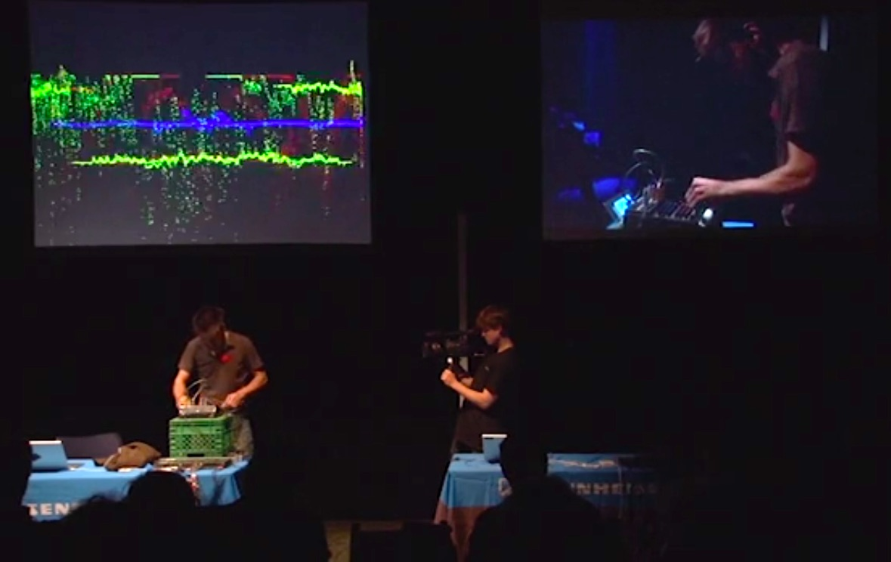
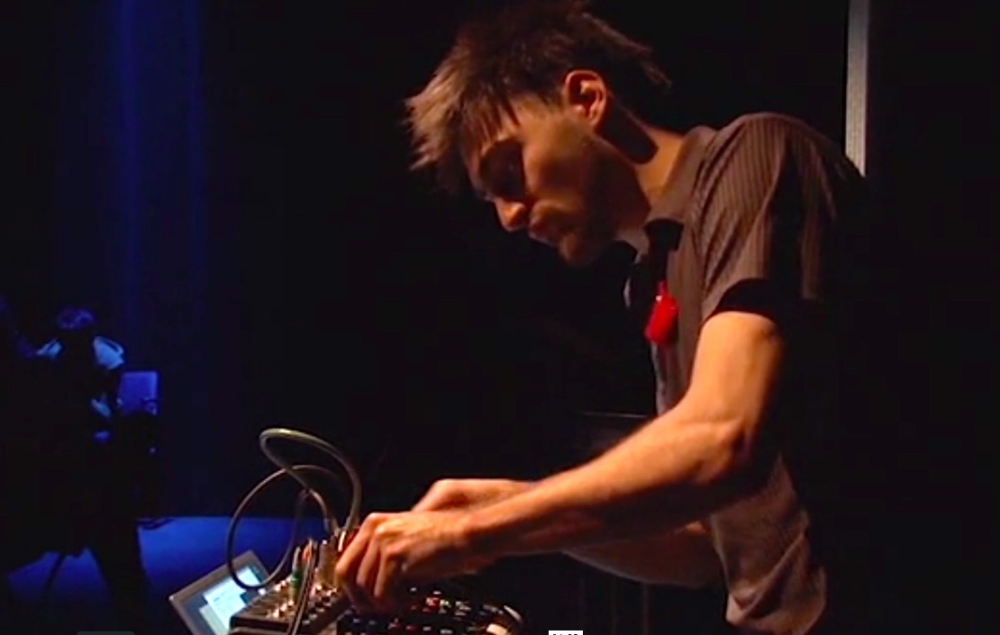
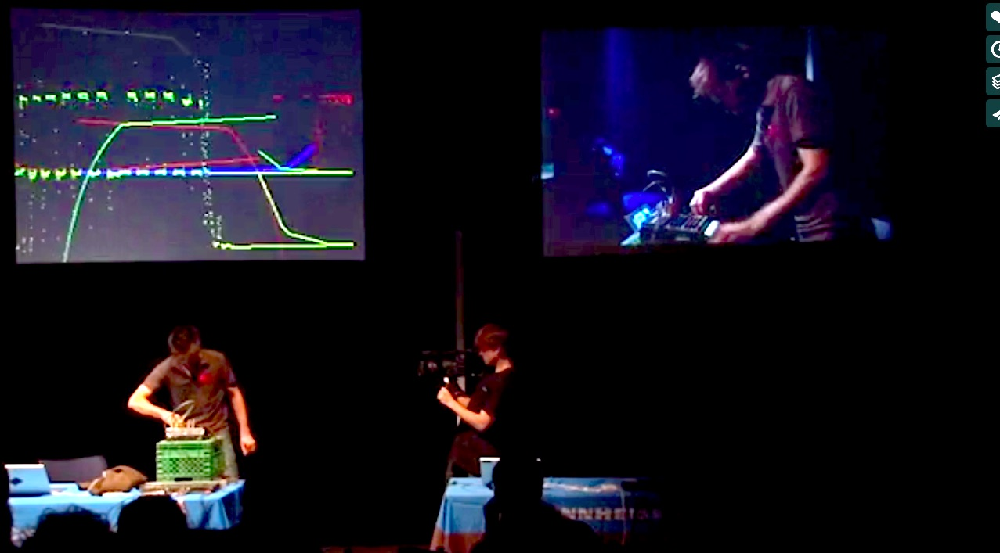

<iframe src="https://player.vimeo.com/video/44742426?color=ffffff&title=0&byline=0&portrait=0" width="100%" height="440" frameborder="0" webkitallowfullscreen mozallowfullscreen allowfullscreen></iframe>

<a href="https://vimeo.com/44742426">2012 - Concours Sennheiser - Guillaume Arseneault - Mise &agrave; terre pour sculpteur de filtres</a> from <a href="https://vimeo.com/audiouqam">audio.uqam.ca</a> on <a href="https://vimeo.com">Vimeo</a>.

Une onde résiduelle est prisonnière d’une boucle infinie. Pour esquiver l’éternelle répétition, elle se réinjecte en effet Larsen. Jusqu’à quel point sa fuite en changera la dynamique spectrale? Court circuit pour mélangeur multipistes.

