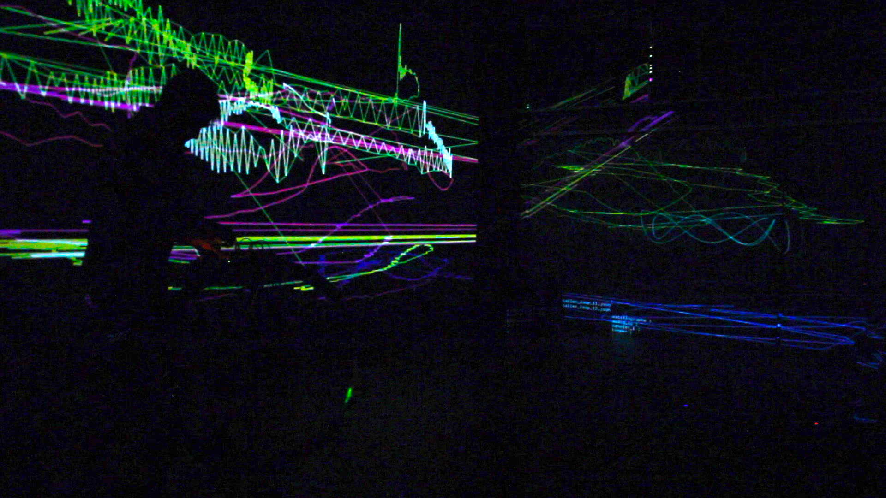
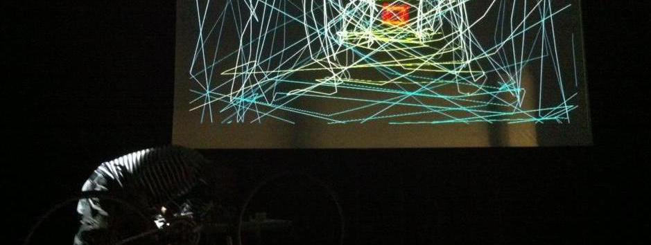

## Context:
This piece is an install action that consists of a "augmented" bicycle in a space accessible by the public (people can interact with the bicycle). At a certain moment the performer use the bike in an expressive way. At that moment, the lights that are already dimmed should be dimmed even more. The performer does his piece, the light goes up a little but the bicycle remains accessible to the public in the space to be "played" with.  

The action of moving the wheels of the bike create sound which is analyzed by different microcomputers. These microcomputers transform audio in video. The microcomputers are near the video projector and are fed with audio signals (1/8 stereo).

 \pagebreak

## Technical requirements : 

* video :
	* 3 wide video projector 
		* 3000+ lumens
		* lens around 0.5 ratio 
		* ac wiring
		* mount material if ceilling mounting is possible
		* 1 x long hdmi cable (from the bicycle to the nearest projector) (30')
		* 2 x short hdmi cable (the microcomputer providing the video signal will be mounted on the projector) (3')
		* should be provided by the venue

* sound 
	* the instrument output a stereo 1/4 unbalanced (provided by the artitst)
	* Stereo PA (must be provided by the venue)
	* Stereo monitoring (needed if the PA is not audible from the performance zone)
	* long 1/8 to 1/8 wires (can be provided by the artist)

* network
	* wireless router for initial configuration (provided by the artist)

* space 
	* The idea is to create an immersive space with a projection and sound all around
	* accessible by the public
	* white/light grey walls are better for projections. 

* light 
	* Dark environment and a dimmed light on the performance zone. 
	* Should be dimmed even more when the performer activates the installation. 

* other :
	* A bicycle is needed prior and while the venue.
	* a little table (keyboard stand) to hold the mixer  

\pagebreak

**Plantation** 3 projectors \
{ width=100%}\

**Wiring** 3 projectors \
{ width=100%}\

