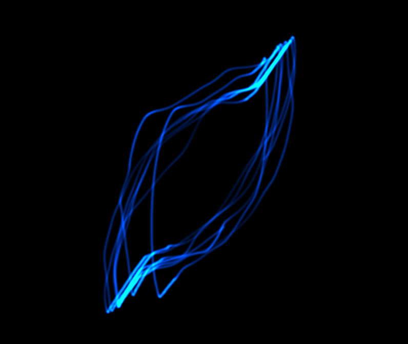
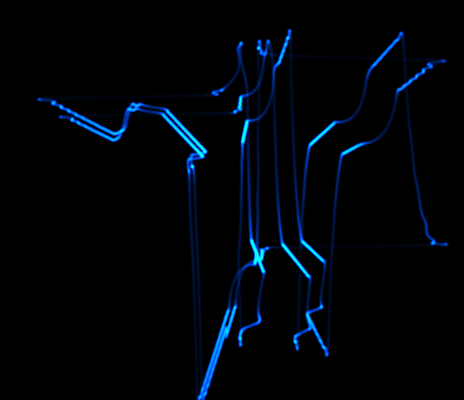
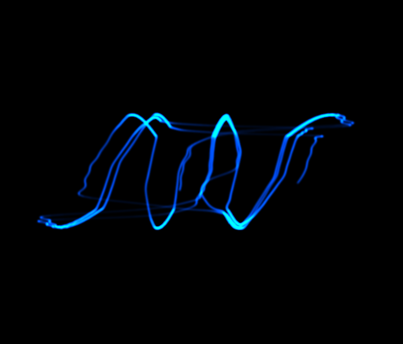

 
 En continuité avec le mouvement de musique pour oscilloscope, Oscillographe amplifie et démocratise l'expérience sinestésique entre son et image tout en le sortant du laboratoire et des instruments de mesure. 

<iframe src="https://player.vimeo.com/video/238415254?color=ff9933&title=0&byline=0&portrait=0" width="100%" height="300" frameborder="0" webkitallowfullscreen mozallowfullscreen allowfullscreen></iframe>

[Oscillographe](https://github.com/gllmAR/oscillographe) est un logiciel d'analyse audio temps réel qui fonctionne tel un oscilloscope tout en ajoutant l'accumulation temporelle ainsi que la 3d à l'équation de visualisation.

Oscillographe-laser est un projet liant la projection laser asservie à la performance sonore temps réel. Basé sur le principe de l'oscilloscope, Oscillographe-laser traduit du signal audio provenant de feedback sensible de phase vers un signal de coordonné XY servant à diriger la trajectoire de lasers. 

Conçue comme instrument de performance scénique et basé sur le protocole ILDA (International Laser Display Association) sa portabilité et sa compatibilité avec du matériel existant maximise la dissémination et la circulation du projet. À l'ère de l'informatisation des performances scéniques, Oscillographe embrasse l'expressivité du signal analogue.

Objectif de l'étude:
- Concevoir le réseau d'amplification adéquat pour transformer un signal audio en signal différentiel -5 à +5 volt 
- Élaborer un mode d'intégration pour contrôler la couleur du laser
- Déterminer les limites de résolution et d'expression du protocole ILDA 
- Mesurer la consommation électrique dans une perspective d'alimentation énergétique à batterie

[Oscillographe.pdf](oscillographe.pdf)

    

