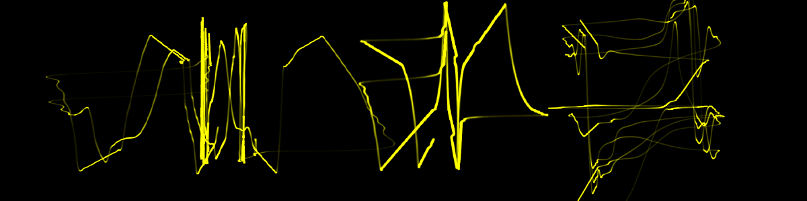
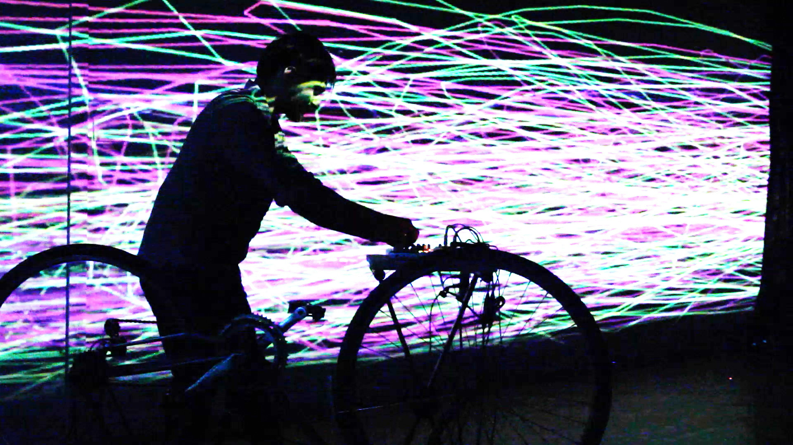
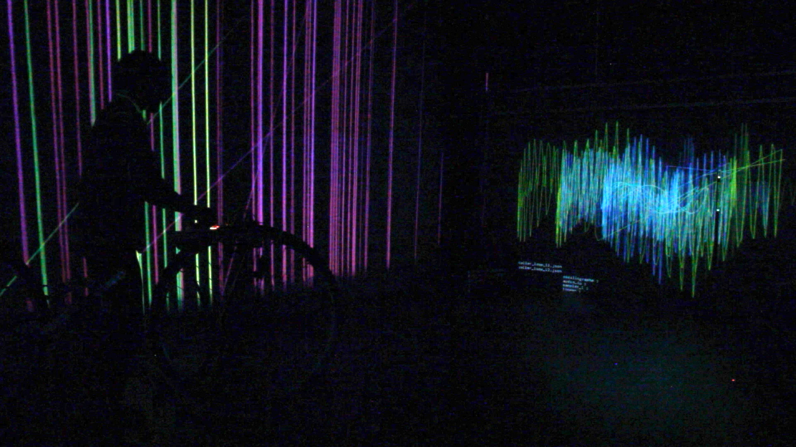
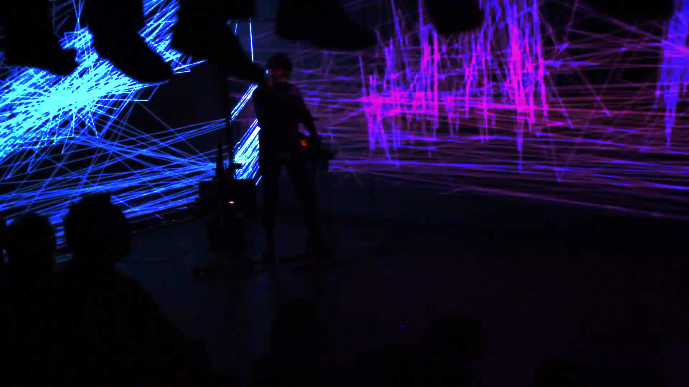
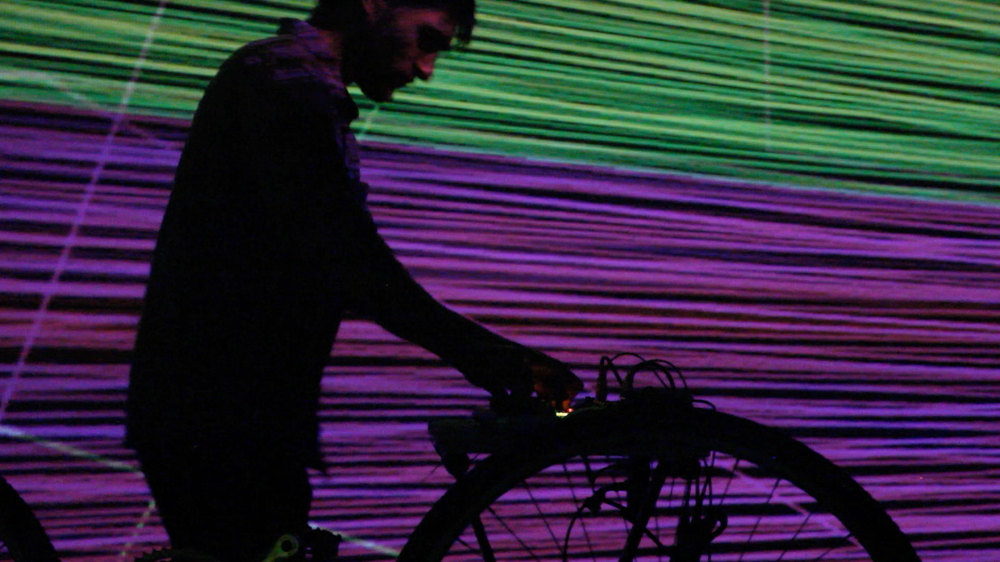
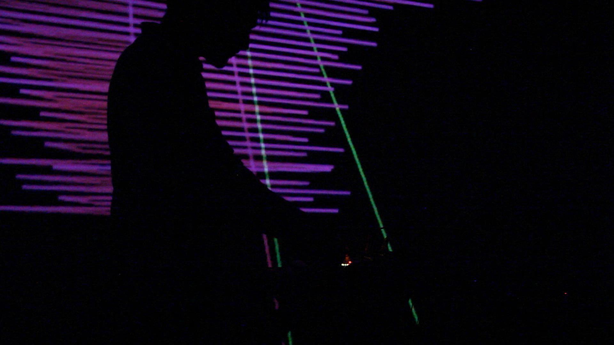
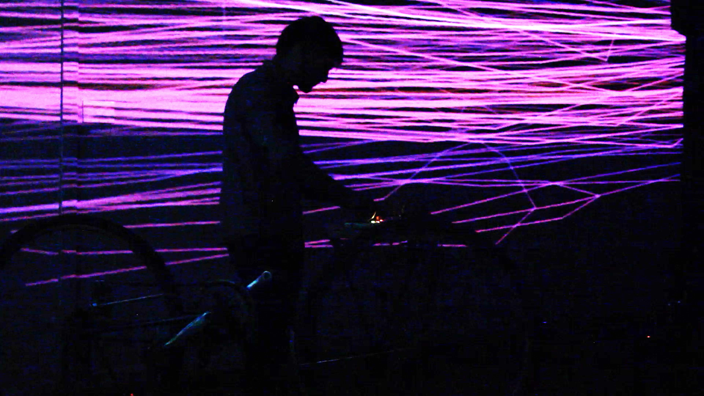
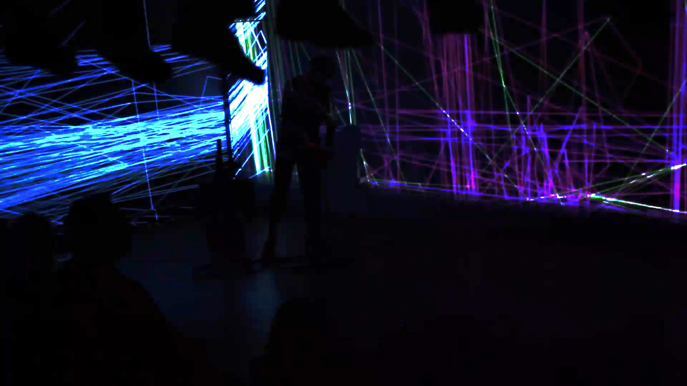
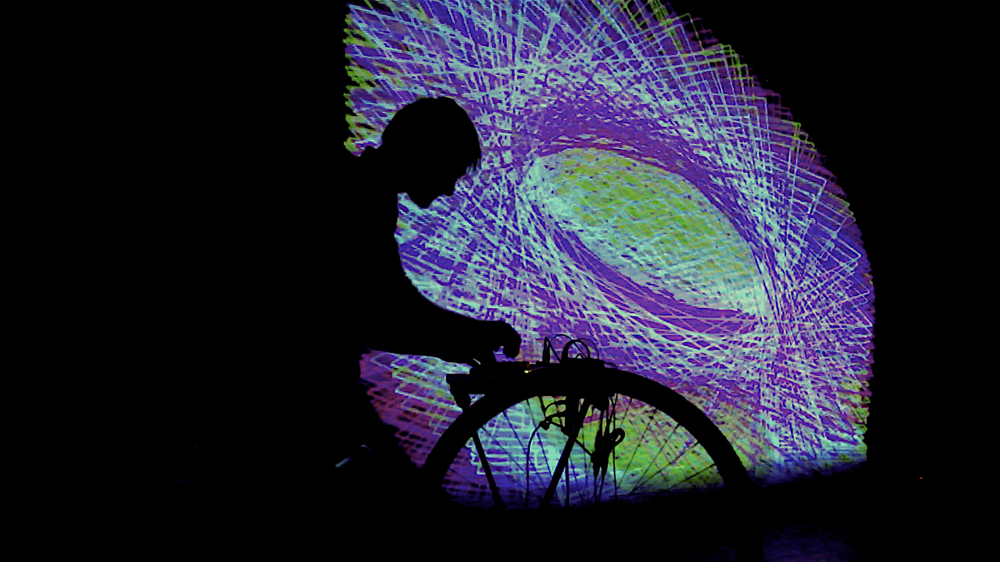
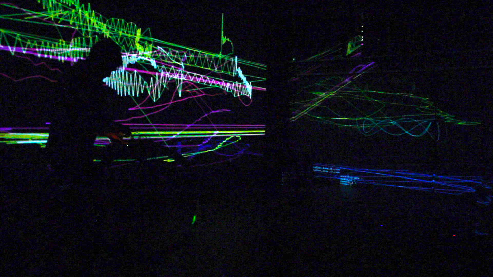

 

[Oscillographe](https://github.com/gllmAR/oscillographe) est un logiciel d'analyse audio temps réel qui fonctionne tel un oscilloscope tout en ajoutant l'accumulation temporelle, l'échantillonage audio ainsi que la 3d au moteur de visualisation. Programmé en C++ en utilisant [Openframeworks](http://openframeworks.cc) et fonctionnant sur un raspberry pi.

<iframe src="https://player.vimeo.com/video/262529537?color=ff9933&title=0&byline=0&portrait=0&quality=720p" width="100%" height="420" frameborder="0" webkitallowfullscreen mozallowfullscreen allowfullscreen></iframe>

Oeuvrant sur les particularités du signal sonore tel que la phase, la fréquence et l'amplitude, Cycles de Feedback pour Oscillographe produit une synesthésie audio visuelle hypnotique de lignes tracées depuis la disparité stéréophonique. Activée par le mouvement, cette installe action d'Oscillographes autonomes cherche à révéler l'intangible exprimé entre l'absence et le court-circuit. 

<!-- 
Un cycle de réinjection cinétique (feedback cycles) est une performance sonore et visuelle pour oscillographe et roues de vélo.

Conçue à partir de feedback sous plusieurs formes, cette performance cherche à révéler l'intangible entre l'absence et le court-circuit.
En continuité avec le mouvement de musique pour oscilloscope, Oscillographe amplifie et démocratise l'expérience sinestésique entre son et image tout en le sortant du laboratoire et des instruments de mesure. 

Les particularités sonores telles que la phase, la fréquence et l'amplitude produisent une synesthésie audio visuelle hypnotique de lignes traçant la disparité stéréophonique. 

Des fragments audio s'entrelacent à de l’échantillonnage et créent des motifs lumineux. 
 -->

    

