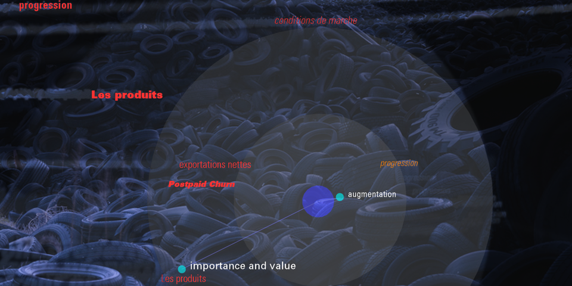

Installation vidéo critique pour pédaliers interactifs; cocréation avec Alexandre Burton; Présenté dans le cadre de C2-MTL, Montréal 2014

Le public est invité à s'asseoir dans deux meubles munis chacun d'un pédalier. Devant eux, deux téléviseurs diffusent de l'image.  

L'action sur le pédalier droit extrait des mots depuis des rapports trimestriels de compagnies fameuses.  En pédalant du côté gauche,  on amalgame ces mots dans un schéma relationnel tout révélant en transparence des images qui manifeste l'envers du profit économique.

Plusieurs fois par heures,  le système tweet le résultat graphique et textuel sur son compte.  
voir : [@rushprjct](https://twitter.com/rushprjct)

 

[https://pbs.twimg.com/media/Bo0YTB3IIAAiMzj.png](https://pbs.twimg.com/media/Bo0YTB3IIAAiMzj.png)
      

[https://pbs.twimg.com/media/Bo0WlNfIAAABucL.png](https://pbs.twimg.com/media/Bo0WlNfIAAABucL.png)
    

[https://pbs.twimg.com/media/Bo0NI3rIIAEtcG4.png](https://pbs.twimg.com/media/Bo0NI3rIIAEtcG4.png)

[https://pbs.twimg.com/media/Boz7ZlrIgAAt0_J.png](https://pbs.twimg.com/media/Boz7ZlrIgAAt0_J.png)

[https://pbs.twimg.com/media/Bovsv3AIMAAuC0p.png](https://pbs.twimg.com/media/Bovsv3AIMAAuC0p.png)

[https://pbs.twimg.com/media/Bovkc2IIEAEfihm.png](https://pbs.twimg.com/media/Bovkc2IIEAEfihm.png)

[https://pbs.twimg.com/media/BovOtQHIAAAapx0.png](https://pbs.twimg.com/media/BovOtQHIAAAapx0.png)

