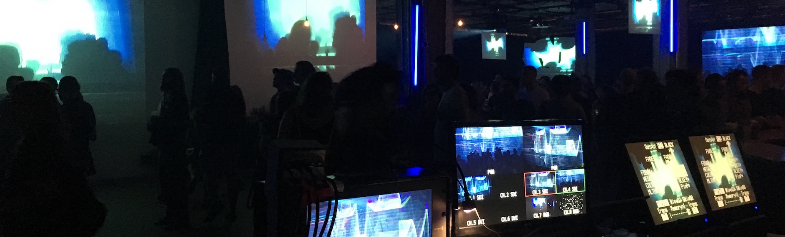

Sentinelle est une scénographie fondée sur la retransmission vidéo en circuit fermé. À l'ère de l’enregistrement assidu de la vie privée, Sentinelle propose un détournement de l'héritage technologique, culturel et politique des appareils d'enregistrement vidéo destinés, entre autres, à la surveillance. Axée sur le temps réel, Sentinelle capture et distribue des points de vue atypiques vers des surfaces de projection suspendues. La mixité des caméras et leurs points de vue produisent des signaux bruts ponctués d’effets optiques, de résolution et de grains. Le feedback vidéo, les plans microscopiques et les caméras motorisées mettent l’accent tant sur des microdétails que l'action sur la scène et dans le public. Entre prises de vue concrètes et plans abstraits, Sentinelle propose une approche en rupture avec la représentation médiatique conventionnelle.

Crée par Jimmy Lakatos et Guillaume Arseneault pour Mutek 2017

Merci à [Soko Slova](https://www.facebook.com/soko.slova/) pour l'opération sensible des machines

[Mutek-jimmy-lakatos-guillaume-arsenault-artificiel-ca](http://www.mutek.org/fr/hub/artists/9384-jimmy-lakatos-guillaume-arsenault-artificiel-ca)

[Mutek-making-stages-and-venues-sing-scenography-at-mutek-2017](http://www.mutek.org/fr/magazine/833-making-stages-and-venues-sing-scenography-at-mutek-2017)

<iframe src="https://player.vimeo.com/video/230821050" width="100%" height="480" frameborder="0" webkitallowfullscreen mozallowfullscreen allowfullscreen></iframe>

