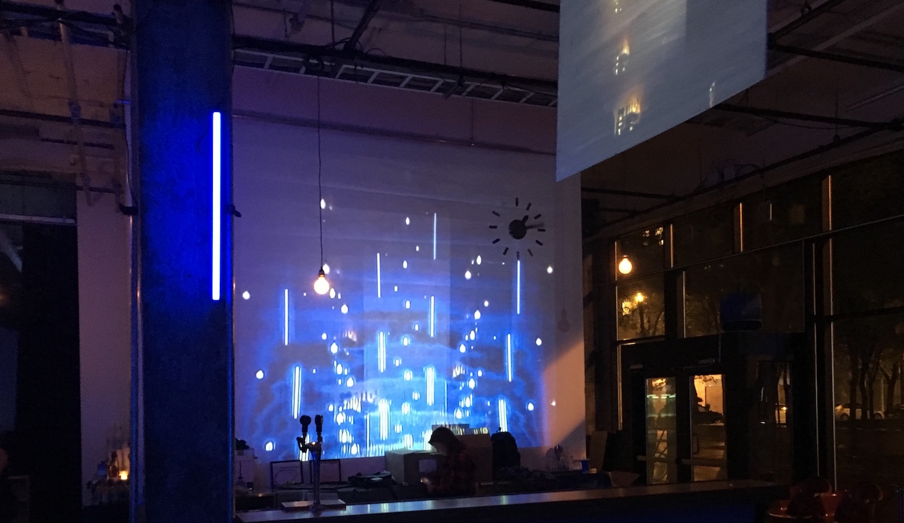
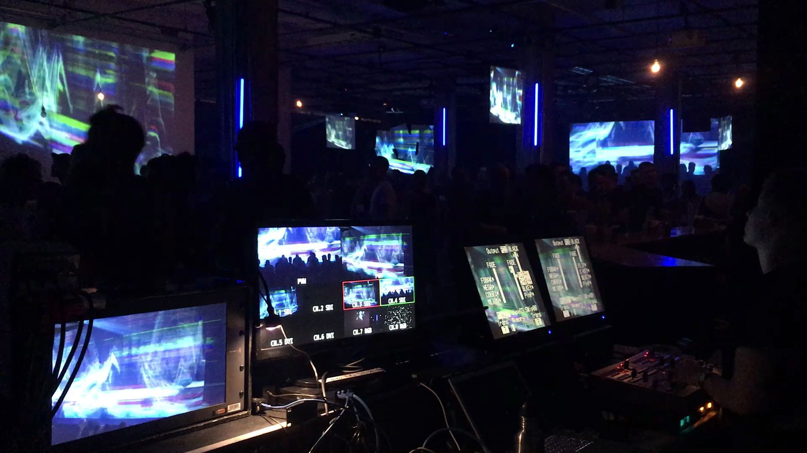
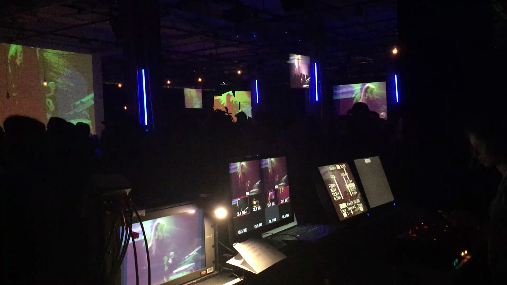

[FR] Sentinelle est une scénographie fondée sur la retransmission vidéo en circuit fermé. À l'ère de l’enregistrement assidu de la vie privée, Sentinelle propose un détournement de l'héritage technologique, culturel et politique des appareils d'enregistrement vidéo destinés, entre autres, à la surveillance. Axée sur le temps réel, Sentinelle capture et distribue des points de vue atypiques vers des surfaces de projection suspendues. La mixité des caméras et leurs points de vue produisent des signaux bruts ponctués d’effets optiques, de résolution et de grains. Le feedback vidéo, les plans microscopiques et les caméras motorisées mettent l’accent tant sur des microdétails que l'action sur la scène et dans le public. Entre prises de vue concrètes et plans abstraits, Sentinelle propose une approche en rupture avec la représentation médiatique conventionnelle.

Crée par Jimmy Lakatos et Guillaume Arseneault pour Mutek 2017 (Montréal)

Opéré avec  [VJ Slova](https://www.facebook.com/soko.slova/) 

[Mutek-jimmy-lakatos-guillaume-arsenault-artificiel-ca](http://www.mutek.org/fr/hub/artists/9384-jimmy-lakatos-guillaume-arsenault-artificiel-ca)

[Mutek-making-stages-and-venues-sing-scenography-at-mutek-2017](http://www.mutek.org/fr/magazine/833-making-stages-and-venues-sing-scenography-at-mutek-2017)

[Mutek-Sentinelle](http://www.mutek.org/en/montreal/2017/artists/9384-jimmy-lakatos-guillaume-arsenault-artificiel-ca)

<iframe src="https://player.vimeo.com/video/230821050" width="100%" height="480" frameborder="0" webkitallowfullscreen mozallowfullscreen allowfullscreen></iframe>

[EN] Sentinelle is a scenography based on closed-circuit video retransmission. In this era of privacy intrusion, Sentinelle offers a diversion to the technological, cultural and political heritage of video recording devices intended, among other things, for surveillance. In real-time, Sentinelle captures and distributes atypical views to suspended projection surfaces. The mix of cameras and their points of view produces raw signals, which are punctuated with resolution and optical effects. Video feedback, microscopic shots and motorized cameras emphasize both micro-detail and action on stage and in the audience. Between concrete shots and abstract plans, Sentinelle proposes an approach that ruptures conventional media representation.

Create by Jimmy Lakatos and Guillaume Arseneault for Mutek 2017 (Montréal)

Operated with [VJ Slova](https://www.facebook.com/soko.slova/) 

↳ [Sebastien Roy](https://www.facebook.com/lephotographiste?fref=mentions&pnref=story)

↳ [Bruno Destombes](https://www.brunodcapture.com)

↳ [Soft Melancholy](https://www.facebook.com/softmelancholy) 

