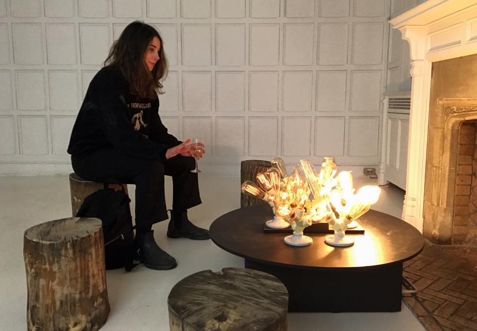
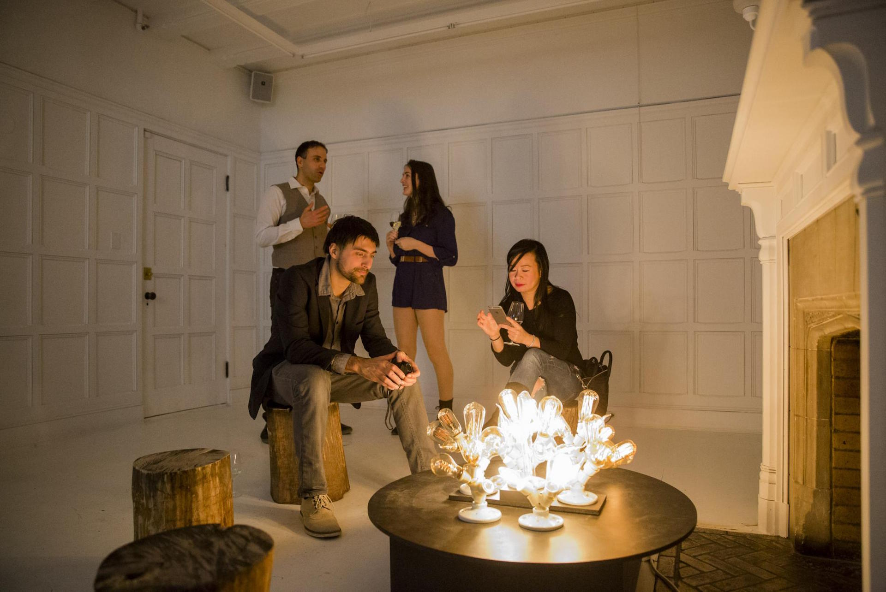
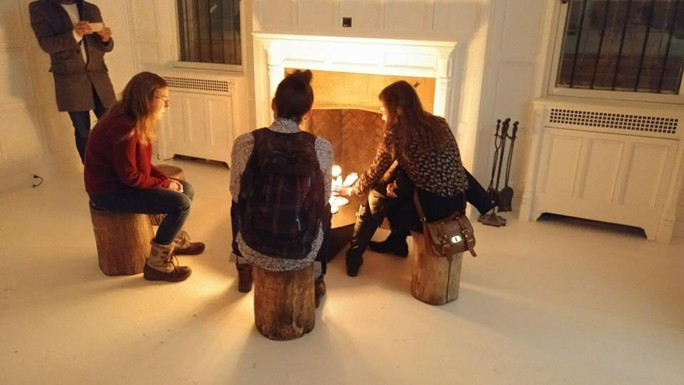
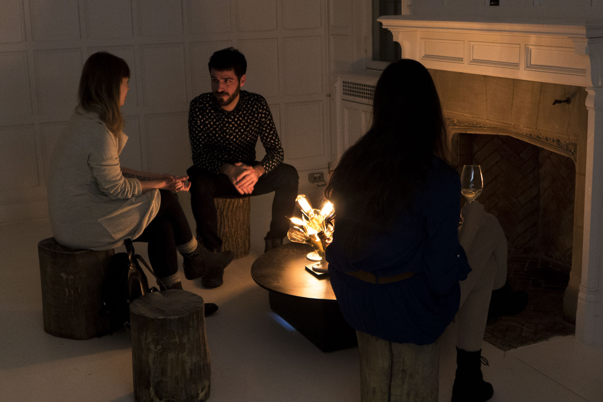

Feu tungstène est un environnement sonolumineux inspiré d'une nuit autour d'un feu.   
Une programmation produit une synthèse sonore de crépitement d'un feu qui s'entend par vibration à travers le bois.
Des données d'amplitude sont extraites du son et servent à étinceler les sept ramifications d'ampoules électriques.  
Feu tungstène cherche à saisir l'aspect hypnotique et certes un peu aléatoire qu'un feu de bois génère naturellement. 

Matériaux :

* ampoules tungstène
* raspberry pi 
* pure data 
* gradateur Ethernet
* transducteur
 
[github.com/gllmAR/pdFuego](https://github.com/gllmAR/pdFuego)

[2017@livArt](http://www.nightlife.ca/2017/02/13/six-artistes-montrealais-lhonneur-dans-lexpo-immersive-sublime-par-artbangbang)

<iframe src="https://player.vimeo.com/video/210507869?title=0&byline=0&portrait=0" width="100%" height="400" frameborder="0" webkitallowfullscreen mozallowfullscreen allowfullscreen></iframe>

Tungsten fire is a light and sound environment inspired by the feeling of a night around a campfire.
Sound synthesis creates the crackling of the fire that is transduce through the wood by vibration. 
Sound amplitude analysis drives the intensity of the 7 independents lights circuits hosting the lightbulbs.
Tungsten fire seek a seize the hypnotic sensation that a fire generates.

Tungsten fire seek to seize the hypnotic sensation generated by the feeling of a night around a campfire.