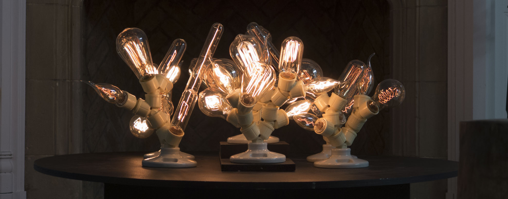
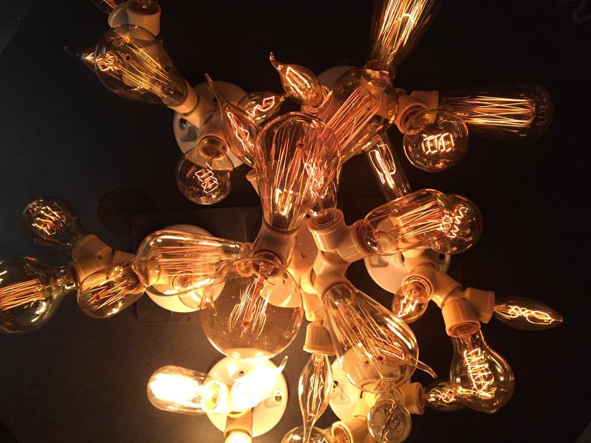
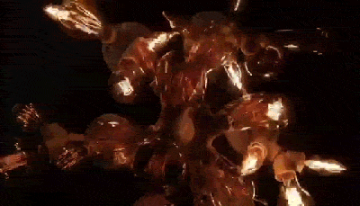

Feu tungstène est un environnement sonolumineux inspiré d'une nuit autour d'un feu.   
Une programmation produit une synthèse sonore de crépitement d'un feu qui s'entend par vibration à travers le bois.
Des données d'amplitude sont extraites du son et servent à étinceler les sept ramifications d'ampoules électriques.  
Feu tungstène cherche à saisir l'aspect hypnotique et certes un peu aléatoire qu'un feu de bois génère naturellement. 

Matériaux :

* ampoules tungstène
* raspberry pi 
* pure data 
* gradateur Ethernet
* transducteur
 
[github.com/gllmAR/pdFuego](https://github.com/gllmAR/pdFuego)

