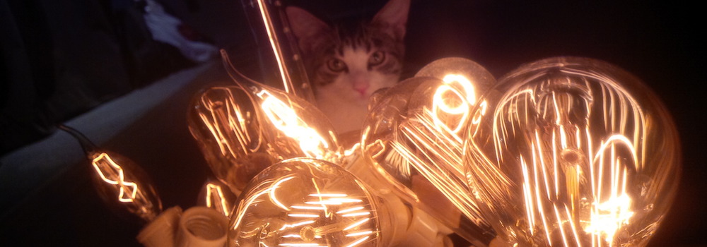

Une synthèse sonore inspirée du crépitement d'un feu s'entend à travers le socle supportant les sept ramifications d'ampoules électriques.
La lumière qu'émettent ces dernières est modulée par les caractéristiques du son produit, le tout créant un environnement sonolumineux inspiré d'une nuit autour d'un feu. 

Matériaux :
	* ampoules tungstène
	* raspberry pi 
	* pure data 
	* gradateur Ethernet
	* transducteur
 
https://github.com/gllmAR/pdFuego

