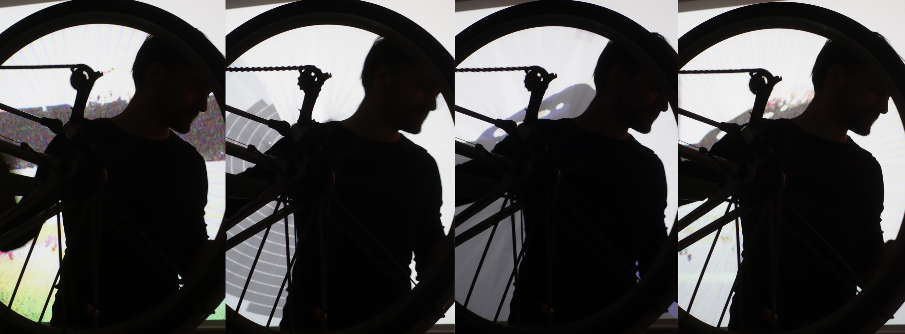
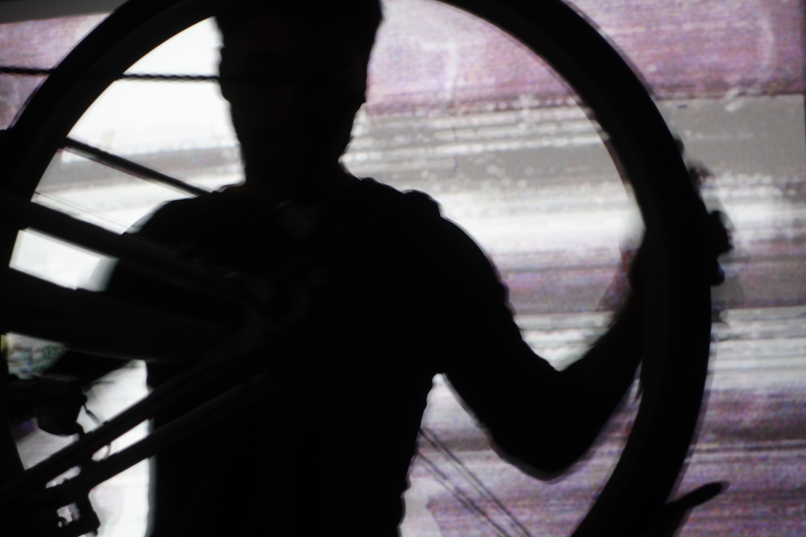
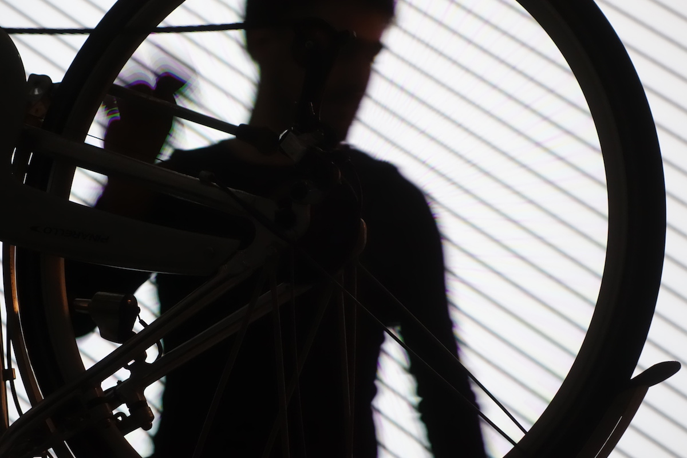
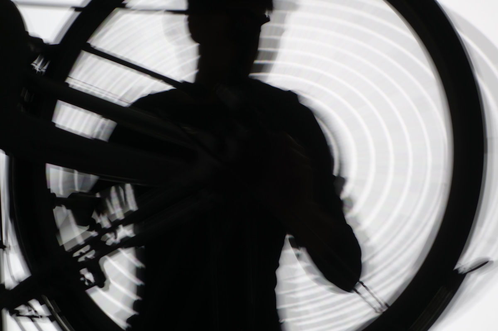
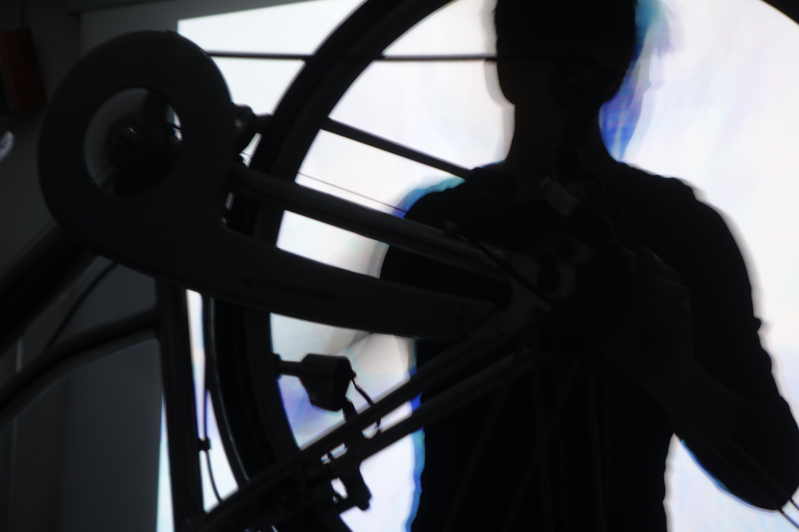
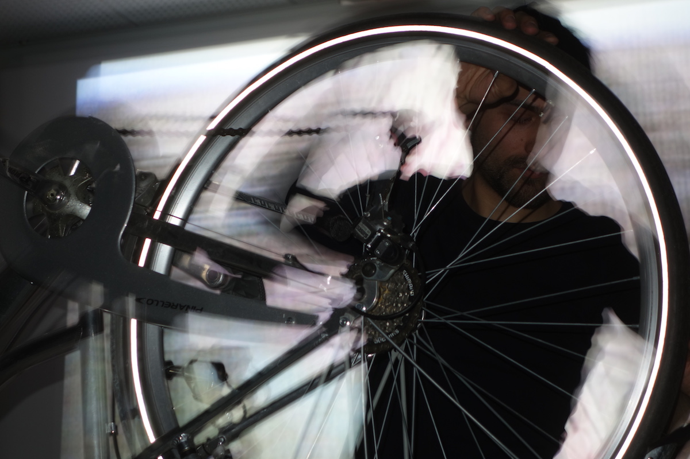
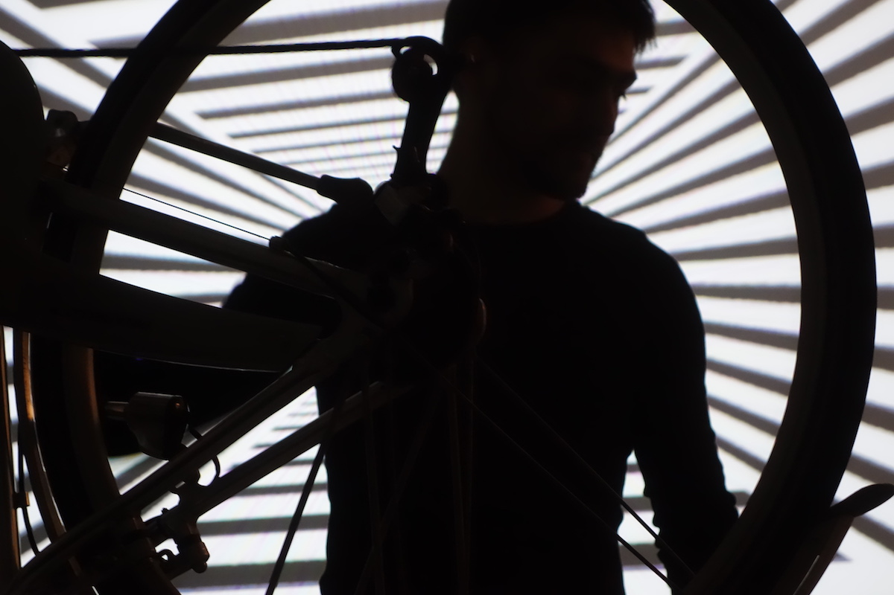
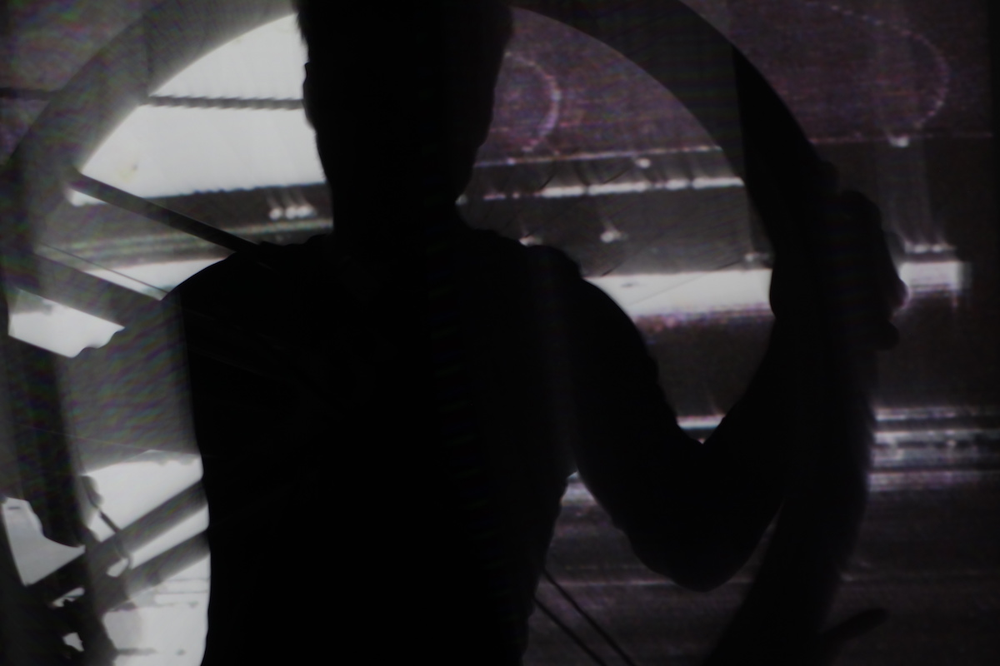
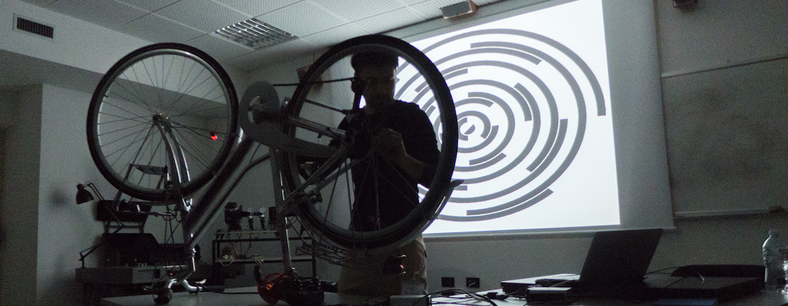

*Veloce*, 2016,  présenté en première mondiale au [FilmForum](http://www.filmforumfestival.it/) à Gorizia en Italie

*Veloce* est une performance où la manipulation des roues d'un vélo génère sons et vidéo.

*Veloce* utilise comme interface les deux roues d'un vélo posé sur une table.  

La roue arrière est asservie à la vitesse de lecture des vidéos tandis que la roue avant contrôle le changement de film depuis un dossier bien garni.

La performance constitue la manipulation de ces roues afin d'en extraire à la fois la sensibilité visuelle et sonore.   

Utilise Max, Arduino et OSX

code et documentation disponible ici

[https://github.com/gllmAR/veloce](https://github.com/gllmAR/veloce)

Crédit photo : Martin Beaulieu

