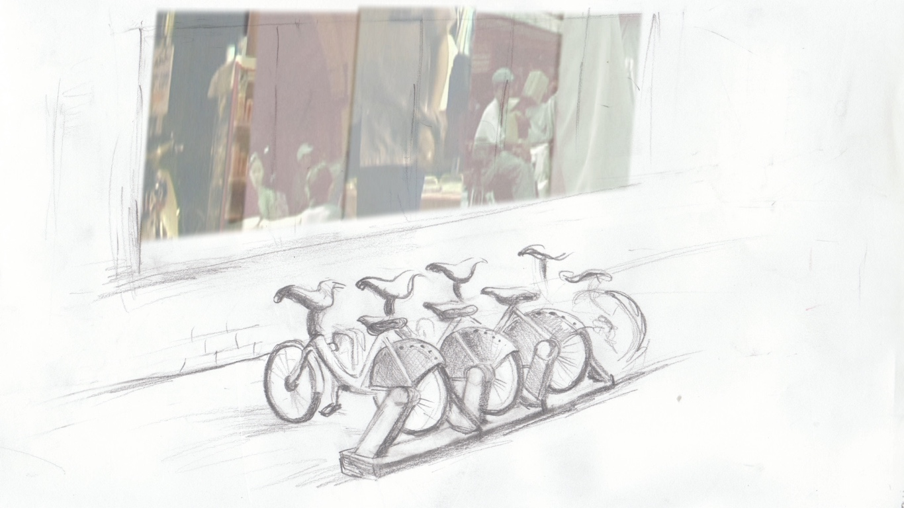
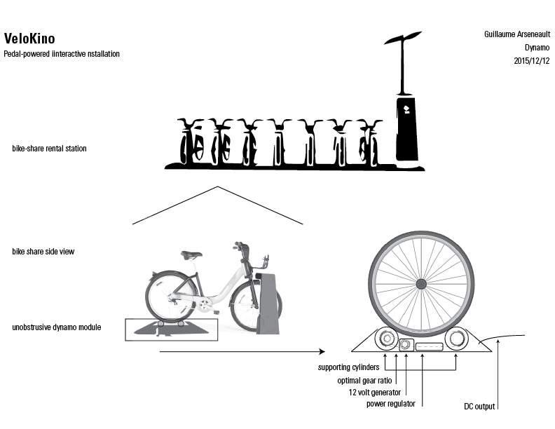
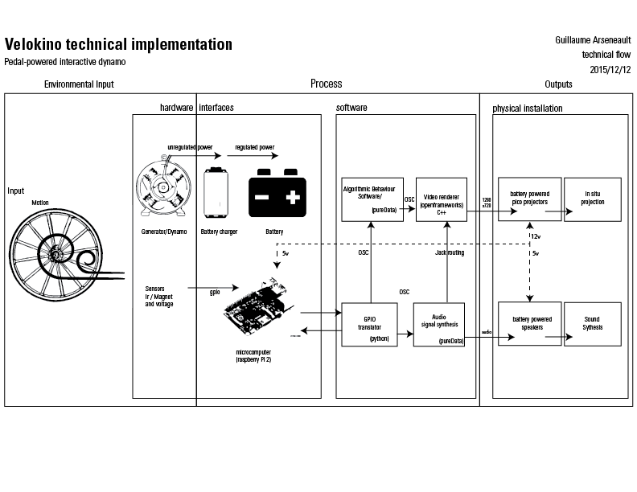

[github.com/gllmAR/velokino](https://github.com/gllmAR/velokino)

VeloKino est une recherche-création axée sur la réinjection cinétique en interactivité.

Issues de variations autour des vélos stationnaires interactifs,  Vélokino explore le registre expressif entre un effort fourni et une réponse audiovisuelle.

Spécifiquement appliquée au mouvement de rotation cyclique, Vélokino à pour objectif  d'être une installation interactive autoalimentée et intégrée au contexte urbain.

Par son usage,  l'installation cherche à suggérer une réflexion sur la consommation électrique individuelle et collective grandissante à l'ère du numérique.

Ce projet s'inscrit dans le cadre d'une maitrise en Média expérimental à l'UQAM réalisé par Guillaume Arseneault et débuté à l'automne 2013.

<iframe src="https://player.vimeo.com/video/69431637?title=0&byline=0&portrait=0" width="100%" height="281" frameborder="0" webkitallowfullscreen mozallowfullscreen allowfullscreen></iframe>
