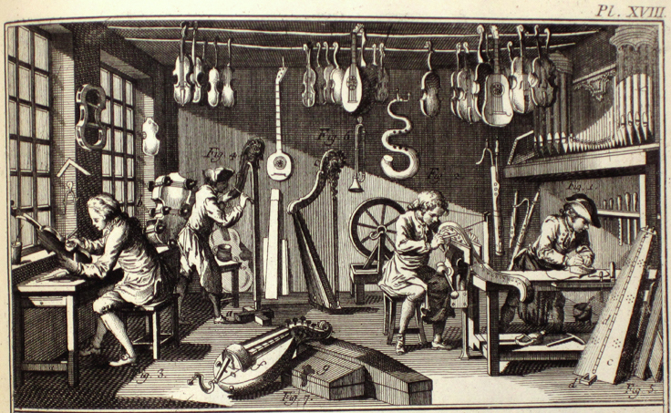

<link rel="stylesheet" href="blackG.css" id="theme">

<section data-markdown>

##  Lutherie numérique : conceptualisation, réalisation et déploiement
### Instruments issus de technologies émergentes

#### Guillaume Arseneault et Gisèle Trudel

#### mars 2017

</section>

<section data-markdown>
# Plan de match
* Démarches créatives respectives
* Lutherie numérique 
* Premier bloc : *Irradier.Irradiate* 
* Deuxième bloc : *Intersidéral* 	
</section>
<section data-markdown>

## Lutherie

Lié au processus d'élaboration d'instruments à cordes, initialement la luth puis par ext. les instruments à cordes et à caisse de résonance.

Lutherie [Dictionnaire raisonné des sciences, des arts et des metiers / Denis Diderot 1762]

</section>

<section data-markdown data-background="numerique_.png">

## Numérique

> Se dit de la représentation de données ou de grandeurs physiques sous forme de nombres (par oppos. à analogique) et par ext. de systèmes, dispositifs ou procédés employant ce mode de représentation.
 

[Le Grand Robert]

</section>

<section data-markdown data-background="impacts_.jpg">

## Lutherie numérique

> forme d'expression dont le "médium" est constitué par les relations réciproques qui s'établissent entre le propos artistique et son implémentation technologique.

Burton, Alexandre. 2000. « Lutherie Numérique » In . Montréal : Festival du nouveau cinéma.

</section>

<section data-markdown>

# Irradier.Irradiate 
#### Premier bloc
* Présentation de l’œuvre en fonction
* Explication démonstration du rôle chacune des composantes  : 
	* Principes de fonctionnement du logiciel libre d’écoutes radio défini par logiciel, GQRX.
	* Différences entre les déploiements 
	* Acquisition et transfert de texture vidéo inter application (openGL/Syphon)  
	* Compositing et mapping via Max Msp/jitter
	* Transmission et traitement de données environnementale depuis Arduino via OSC
	* Traitement audio temps réel via Pure Data sur raspberry pi
	* WebApp de contrôle OSC (Nodejs et rhizome)  

* Écologie technologique

</section>

<section data-markdown data-markdown data-background="irradier.svg">

</section>

<section data-markdown>
#OSC
open sound control
* Protocol de transmission UDP via réseau local
* lisible et flexible 
* adresse séparé par le symbole /
* supporte plusieurs types de données
* fonctionne avec une adresse de destination et un port.

[opensoundcontrol.org/introduction-osc](http://opensoundcontrol.org/introduction-osc)
</section>

<section data-markdown>
#Arduino

* plateforme de développement
	* Matériel (la plaquette)
	* Logiciel  (l'environnement de développement)
* permet de faire des opération sur des signaux électrique
	* lecture
	* écriture
* communique plusieurs protocoles, notamment 
	* USB sériel
	* OSC (via ethernet) 	
* démarrage instantané 
* fait une chose à la fois

[arduino.cc](https://www.arduino.cc)
</section>

<section data-markdown>
#Raspberry pi
* micro ordinateur
* roule Linux (raspbian, archlinux et autre)
* à des GPIO, un port ethernet, des ports USB, wifi, bluetooth
 

</section>

<section data-markdown>
#Syphon
</section>

<section data-markdown>
#Intersidéral

#### Deuxième bloc

Dans ce deuxième bloc, la discussion portera sur l’ordinateur portable Raspberry pi et la plateforme OpenFrameworks (langage C++) dans leur rapport à l’animation de l’image et aux éclairages DEL.

*Démonstration des composantes  : 
	* Présentation de l’environnement de développement OpenFrameworks
	* Protocole DMX, interface matériel et application OSC->DMX 
	* Principes de fonctionnement de l’application d’échantillonnage
	* Système de lecture d’images
	* Sous-échantillonnage via FrameBuffer
	* Fonctionnement et dessin temporel de l’orbite 
	* Intégration générale de l’ensemble
	* Principes de déploiement et d’automation sous linux (systemD)

</section>

<section data-markdown>
liens 
https://github.com/antimodular/Best-practices-for-conservation-of-media-art
</section>

<section data-markdown>
## Guillaume Arseneault

### [gllmar.github.io](http://www.gllmar.github.io)

### [guillaume@artificiel.org](mailto:guillaume@artificiel.org)

</section>

