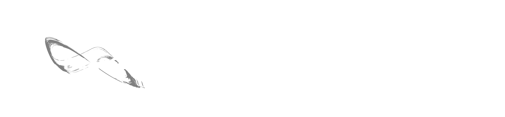
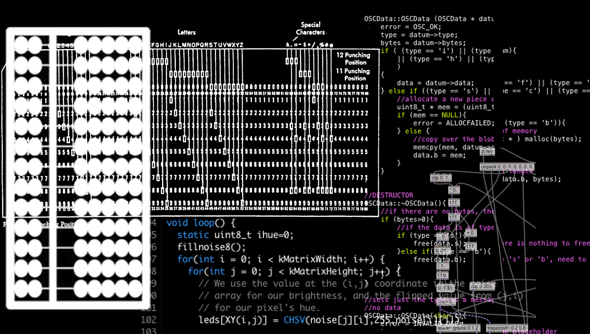
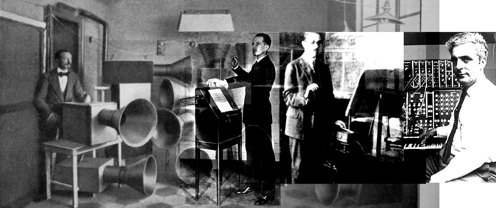
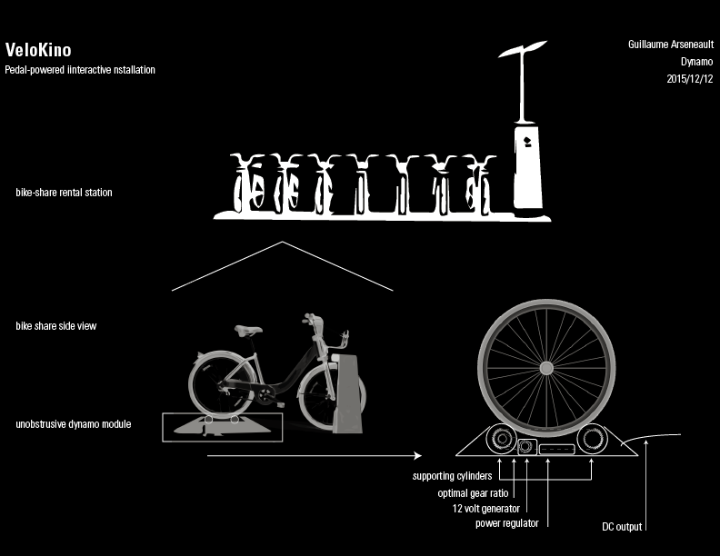
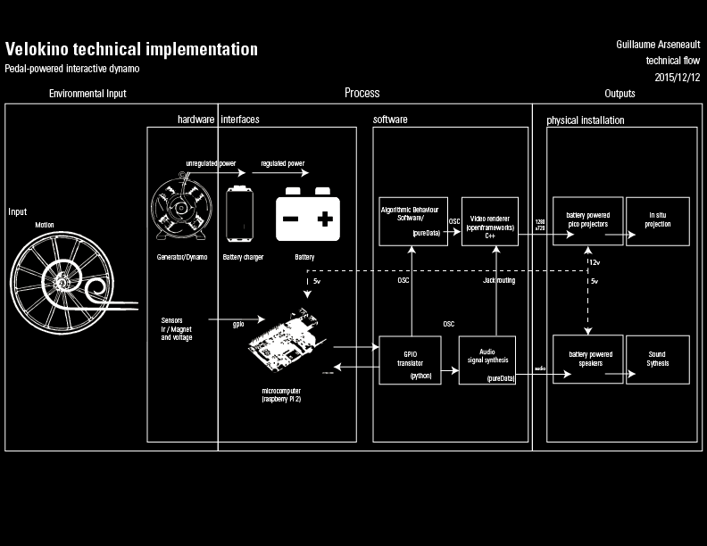

<link rel="stylesheet" href="blackG.css" id="theme">

<section data-markdown>

#  *Lutherie numérique* & interactivity

## Research based practice on crafting interactive audiovisual experiences.  

### Guillaume Arseneault

laureando *Recherche-création en média expérimental* UQAM

</section>

<section data-markdown>

## Lutherie

Related to the process of crafting string instruments

Lutherie [from Dictionnaire raisonné des sciences, des arts et des metiers / Denis Diderot]

<!--
Commentaire sur la traduction  

-->

</section>

<section data-markdown>
## *Numérique* / Numeric
Representation through a number system, often related to computerized operations.

</section>

<section data-markdown>
## Lutherie numérique

> forme d'expression dont le "médium" est constitué par les relations réciproques qui s'établissent entre le propos artistique et son implémentation technologique.

Burton, Alexandre. 2000. « Lutherie Numérique .» In . Montréal : Festival du nouveau cinéma.

: expressive form emerging from the reciprocal relations between artistic intents and his technological implementations

- The act of choosing the components for a purpose, getting them to work together and making the instrument expressive.
- Where a computer and programmation is injected between the instrument and the performance output
- The importance of real-time is critical to get physicality of the instrument

<!--

Apprentis de Burton

Exemple : pour préciser ce en quoi la lutherie numérique se distingue

Artificiel : Bulbes

Create the hardware and the software to

-->

</section>

<section data-markdown>

## Research based practice & experimental media
* #### Iterative’s cycles of prototyping and demonstrations
* #### Artistic process feed from heuristic feedback
* #### Reflective praxis

Authors :

* Owen Chapman & Kim Sawchuk :  “Research-Creation: Intervention, Analysis and Family Resemblances.’”

* Louis Claude Paquin : "Méthodologie de la recherche-création"
* Pierre Gosselin, Éric Le Coguiec : "
La recherche création :
Pour une compréhension de la recherche en pratique artistique
"

</section>

<section data-markdown>

## Analog Pioneers
* [Luigi Russolo] 1885–1947
	* Intonarumori (Mechanical sound automates)
* [Leon Theremine] 1896-1993
	* invented the *Theremine* 	
* [Maurice Martenot] 1898-1980
	* invented the *ondes Martenot*
* [Robert Moog] May 1934-2005  
	* known for his work on the analogue synthesizer

</section>

<section data-markdown>

##  *Lutherie numérique* : Contemporary

* [Miller Pucket](http://msp.ucsd.edu/)
	* Augmented orchestra (live)
	* [pureData](http://msp.ucsd.edu/Pd_documentation/) & [PDRP](http://msp.ucsd.edu/pdrp/latest/files/doc/)
* [David Rockeby](http://www.davidrokeby.com/vns.html)
	* Interactive Video tracking System : (Surveillance art)
	* Very Nervous System and softVNS
* [Alexandre Burton](http://www.artificiel.org/burton)
	* Electroacoustic compositions with electric phenomenons
	* Teslacoils & Fiber optic teslacoil driver [impact](http://www.artificiel.org/impacts)
	* 1000 watts bulbs & sound emmiting dimmers light dimmer [condemned_bulbs](http://www.artificiel.org/bulbes)

</section>
<!--

https://cycling74.com/2009/11/21/an-interview-with-robert-henke/#.Vt3z7sfKJOo

Klaus obermayer
alvin oto

-->

<section data-markdown>
## Motivations
* Generate novel experiences modified by the user engagements    
* Create interfaces-instruments with expressive range accessible  
* Deploy interactive installations in public spaces
* Share and document this process among the Makers community (open source)
* Contribute to democratize technological creations trought low cost hardware

</section>

<section data-markdown>
## VeloKino

* 2012 [B-Cycle](/projets/bcycle)
* 2013 [Kinopedal](/projets/pedalier)
* 2014 [RUSH](/projets/rush)
* 2014 [Marcels](/projets/marcels)
* 2015 [Arbol](/projets/arbol)
* 2016 ...

</section>

<section data-markdown>

</section>

<section data-markdown>

</section>

<section data-markdown>
## Demo [or die]

Create your own instruments usign open source software.

ThereminIr

[github.com/gllmar/thereminir](http://github.com/gllmar/thereminir)

[*Demo or die* : Nicolas Negroponte,  MIT Media lab]

</section>

<section data-markdown>
# Q/A? 	

</section>

<section data-markdown>
## Guillaume Arseneault

### [gllmar.github.io](http://www.gllmar.github.io)

### [guillaume@artificiel.org](mailto:guillaume@artificiel.org)

</section>
